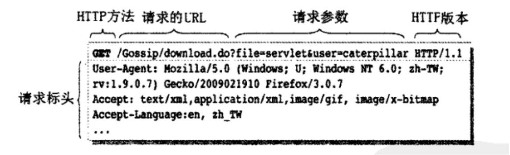
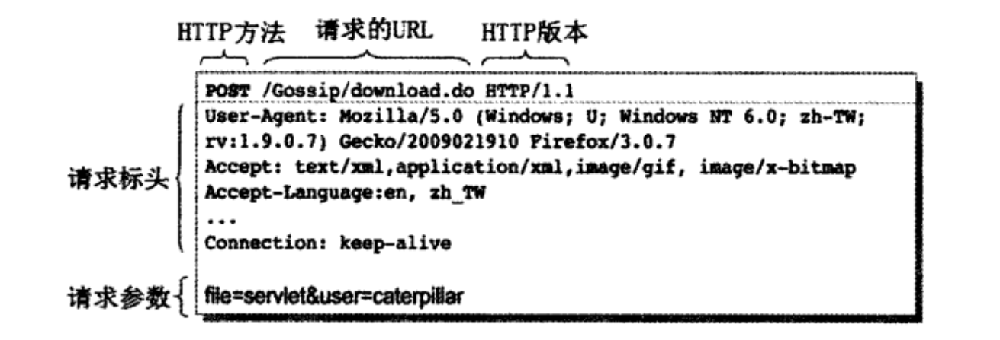

# HTTP协议两个重要的特性
* 基于请求（Request）/响应（Response）模型
* 无状态（Stateless）通信协议

HTTP是一种基于请求/响应的通信协议，客户端对服务器发出一个取得资源的请求，服务器将要求的资源响应给客户端，每次的联机只作一次请求/响应，是一种很简单的通信协议，没有请求就不会有响应。

在HTTP协议之下，服务器端是个健忘的家伙，服务器响应客户端之后，就不会记得客户端的信息，更不会去维护与客户端有关的状态，因此HTTP又称为无状态。

# GET请求
GET请求，顾名思义，就是向服务器取得（GET）指定的资源，在发出GET请求时，必须一并告诉服务器所请求资源的URL，以及一些标头（Header）信息。例如，一个GET请求的发送范例如图所示。

# POST请求
POST请求，顾名思义，就是在请求时发布（POST）信息给服务器，对于大量或复杂的信息发送（如文件上传），基本上会采用POST来进行发送。一个POST发送的范例如图所示。

# 如何选用 GET或POST？
* 从功能面上，可以用以下方式来决定该选用GET或POST：
  
  * GET请求跟随在URL之后的请求参数长度是有限的，过长的请求参数，或如文件上传这类的大量数据，就不适合用GET请求，而应该改用POST请求。
  * GET请求的请求参数会出现在地址栏上，敏感性或有安全性考虑的请求参数（如信用卡号码、用户名、密码等），就不应该使用GET请求来发送。
  * POST请求的请求参数不会出现在地址栏上，所以无法加入浏览器的书签（Bookmark）之中，如果有些页面是根据请求参数来作不同的画面呈现（如论坛的文章发表），而你希望可以让用户设定书签，以便日后可以直接点击书签浏览，则应该使用GET请求。
  * 有些浏览器会依网址来缓存（Cache）数据，如果网址是相同的URL，则会直接从浏览器缓存中取出数据，而不会真正发送请求至服务器上查询最新的数据。如果不希望服务器状态改变了，而浏览器仍从缓存中取得旧的资料，则可以改用POST请求（使用GET请求也可以避免缓存，例如在网址上附加时间戳，让每次GET请求的网址都不相同）。
  
* 另外，还有另一个非功能面上的考虑，但其实也是HTTP当初在设计时区分GET与POST的目的之一，就是按请求是否为等幂（idempotent）操作来决定使用GET或POST。
所谓是否为等幂操作，就是请求的操作是否改变服务器状态，同一个操作重复多次，是否传回同样的结果。

  * GET请求应该用于等幂操作。GET请求纯粹取得资源，而不改变服务器上的数据或状态。GET的请求参数，只是用来告知服务器，必须进一步根据请求参数（而不只是URL）来标识出要响应的内容（例如查询数据库的数据），同样的GET请求且使用相同的请求参数重复发送多次，都应该传回相同的结果。
  * POST 请求应该用于非等幂（non-idempotent）操作。POST请求发送的数据，可能会影响服务器上的数据或状态，例如修改（增、删、更新）数据库的内容，或是在服务器上保存文件。你的请求若会改变服务器的状态，则应改用POST请求。