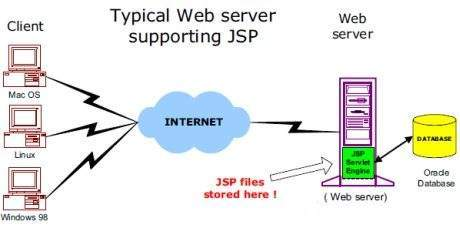
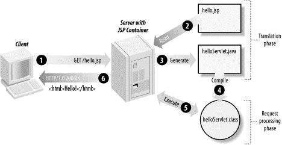

Web服务器需要一个JSP引擎，即一个处理JSP页面的容器(类似于：Tomcat和Jetty)。 JSP容器负责拦截JSP页面的请求。本教程使用内置JSP容器的Apache Tomcat来支持JSP页面的开发。
JSP容器与Web服务器配合使用以提供运行时环境和JSP需要的其他服务。它知道如何解释作为JSP一部分的特殊元素。
下面的架构图显示了JSP容器和JSP文件在Web应用程序中的位置。

# JSP处理
以下步骤说明Web服务器如何使用JSP创建Web页面 -
* 与一般的页面一样，浏览器向Web服务器发送HTTP请求。
* Web服务器识别HTTP请求是针对JSP页面，并将其转发给JSP引擎。这可以通过使用以`.jsp`(而不是`.html`结尾)的URL或JSP页面完成。
* JSP引擎从磁盘加载JSP页面并将其转换为servlet内容。这个转换非常简单，所有模板文本都转换为`println()`语句，并将所有JSP元素转换为Java代码。此代码实现页面的相应动态行为。
* JSP引擎将servlet编译为可执行类，并将原始请求转发到servlet引擎。
* Servlet引擎的Web服务器加载Servlet类并执行它。在执行期间，servlet生成HTML格式的输出。HTTP响应中的servlet引擎将输出传递给Web服务器。
* Web服务器根据HTTP响应将静态HTML内容转发到浏览器。
* 最后，Web浏览器处理HTTP响应中动态生成的HTML页面，就像它是静态页面一样。

通常，JSP引擎将检查JSP文件的servlet是否已存在，并且JSP上的修改日期是否比servlet更旧。 如果JSP早于其生成的servlet，则JSP容器将会认为(假定)JSP尚未更改，生成的servlet仍然与JSP的内容相匹配，从而不必重新生成。这使得该过程比其他脚本语言(如PHP)更加有效，因此更快。
所以在某种程度上，JSP页面实际上只是另一种编写servlet的方式。除了编译阶段，JSP页面的处理方式与一般的servlet完全相同。

