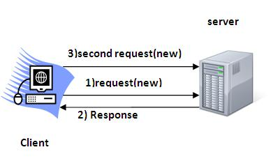

会话只是指一段指定的时间间隔。
会话跟踪是维护用户状态(数据)的一种方式。它也被称为servlet中的会话管理。
Http协议是一个无状态的，所以我们需要使用会话跟踪技术来维护用户状态。 每次用户请求服务器时，服务器将请求视为新请求。 所以需要保持一个用户的状态来识别特定的用户。
HTTP是无状态的，这意味着每个请求被认为是新的请求。如下图所示：

# 为什么使用会话跟踪？

因为需要用于识别特定的用户。

# 会话跟踪技术
会话跟踪中使用的技术有四种：

* Cookies
* 隐藏表格
* 域网址重写
* HttpSession

