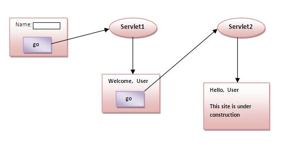

Cookie是在多个客户端请求之间持久存储的一小段信息。
Cookie具有名称，单个值和可选属性，例如注释，路径和域限定符，生存周期和版本号。

# Cookie工作原理
默认情况下，每个请求都被视为新的请求。在cookie技术中，servlet响应可以添加cookie。 所以cookie存储在浏览器的缓存中。之后，如果用户发出请求，默认情况下会带上cookie。 因此，我们就可以知道用户旧用户。

# Cookie类型
Servlet中有2种类型的Cookie。
* 非持久性cookie
* 持久性Cookie

## 非持久性cookie
它仅适用于单个会话。当用户关闭浏览器时都会删除它。

## 持久性Cookie
它对多个会话有效。当用户关闭浏览器时也不会删除它。只有在用户注销或注销时才被删除。

# Cookie的优点
* 维持状态最简单的技术。
* Cookie在客户端维护。

# Cookie的缺点
* 如果从浏览器中禁用Cookie，则无法正常工作。
* 只能在Cookie对象中设置文本信息。

# Cookie类
javax.servlet.http.Cookie类提供了使用Cookie的功能。它为Cookie提供了很多有用的方法。

## Cookie类的构造方法
构造方法|描述
--|--
`Cookie()`|构建一个cookie。
`Cookie(String name, String value)`|构造具有指定名称和值的cookie。

## Cookie类的方法
下面中给出了一些常用的Cookie类方法。
方法|描述
--|--
`public void setMaxAge(int expiry)`|设置cookie的最大生命周期(以秒为单位)。
`public String getName()`|返回cookie的名称。创建后无法更改名称。
`public String getValue()`|返回cookie的值。
`public void setName(String name)`|更改cookie的名称。
`public void setValue(String value)`|更改cookie的值。

# 使用Cookies所需的其他方法
要添加cookie或从cookie获取值，需要其他接口提供的一些方法。它们分别是：
* `public void addCookie(Cookie ck)`：`HttpServletResponse`接口的方法用于在响应对象中添加cookie。
* `public Cookie[] getCookies()`：`HttpServletRequest`接口的方法用于从浏览器返回所有的cookie。

# 如何创建Cookie？
下面来看看创建cookie的简单代码。
~~~java
// 创建cookie对象
Cookie ck=new Cookie("user","maxsu jaiswal");
// 添加cookie对象到响应中
response.addCookie(ck);
~~~

# 如何删除Cookie？
下面来看看删除cookie的简单代码。它主要用于注销或注销用户。
~~~java
// 删除cookie的值
Cookie ck=new Cookie("user","");
//  将最大生命周期改为0秒
ck.setMaxAge(0);
// 添加cookie对象到响应中
response.addCookie(ck);
~~~

# 如何获取Cookie？
下面来看看简单的代码用来获取所有的cookies。
~~~java
Cookie ck[]=request.getCookies();  
// 打印cookie的名称和值
for(int i=0;i<ck.length;i++){  
    out.print(" "+ck[i].getName()+" "+ck[i].getValue());
}
~~~

# Servlet Cookie的应用示例
在这个例子中，我们将用户名称(`username`)存储在cookie对象中，并在另一个servlet中访问它，会话对应于特定用户。所以如果从多个浏览器访问指定cookie名称，那么将得到不同的值。

ServletCookie01.java
~~~java
@WebServlet(name = "ServletCookie01")
public class ServletCookie01 extends HttpServlet {
    @Override
    protected void doPost(HttpServletRequest request, HttpServletResponse response) throws ServletException, IOException {
        // 设置服务器端内容类型
        response.setContentType("text/html");
        // 设置服务器端编码
        response.setCharacterEncoding("utf-8");
        // 获取服务器端输出对象
        PrintWriter out = response.getWriter();

        // 获取用户名
        String name = request.getParameter("userName");
        String userName = new String(name.getBytes("ISO-8859-1"),"UTF-8");

        out.println("<!DOCTYPE html>\r\n"+
                "<html>\r\n"+
                "<head>\r\n"+
                "<meta charset=\"utf-8\">\r\n"+
                "<body>"
        );
        out.println("欢迎您 "+userName);

        // 创建Cookie对象
        Cookie cookie = new Cookie("userName",userName);
        // 添加Cookie对象
        response.addCookie(cookie);

        out.print("<form action='servlet2' method='post'>");
        out.print("
Cookies已在浏览器中设置，现在跳转到第二个Servlet中读取Cookies的值。
");
        out.print("<input type='submit' value='提交到第二个Servlet'>");
        out.print("</form>");

        out.close();
    }
}
~~~

ServletCookie02.java
~~~java
@WebServlet(name = "ServletCookie02")
public class ServletCookie02 extends HttpServlet {
    @Override
    protected void doPost(HttpServletRequest request, HttpServletResponse response) throws ServletException, IOException {
        // 设置服务器端内容类型
        response.setContentType("text/html");
        // 设置服务器端编码
        response.setCharacterEncoding("utf-8");
        // 获取服务器输出对象
        PrintWriter out = response.getWriter();

        // 获取Cookie
        Cookie[] cookie = request.getCookies();

//        // 遍历Cookie
//        for(int i=0;i<cookie.length;i++){
//            out.print(" "+i+cookie[i].getName()+" "+cookie[i].getValue());
//        }

        out.println("Hello "+cookie[3].getValue());
    }
}
~~~

Cookie.html
~~~html
<!DOCTYPE html>
<html lang="en">
<head>
    <meta charset="UTF-8">
    <title>Cookies in Servlet</title>
</head>
<body>
    

        <form action="servlet1" method="post">
            用户名:<input type="text" name="userName" value="krislin"><input type="submit" value="提交">
        </form>
    

</body>
</html>
~~~

web.xml
~~~xml
<?xml version="1.0" encoding="UTF-8"?>
<web-app>
  <display-name>Servlet Cookies</display-name>
  <welcome-file-list>
    <welcome-file>Cookie.html</welcome-file>
  </welcome-file-list>
  <servlet>
    <servlet-name>ServletCookie01</servlet-name>
    <servlet-class>ServletCookie01</servlet-class>
  </servlet>
  <servlet-mapping>
    <servlet-name>ServletCookie01</servlet-name>
    <url-pattern>/servlet1</url-pattern>
  </servlet-mapping>
  <servlet>
    <servlet-name>ServletCookie02</servlet-name>
    <servlet-class>ServletCookie02</servlet-class>
  </servlet>
  <servlet-mapping>
    <servlet-name>ServletCookie02</servlet-name>
    <url-pattern>/servlet2</url-pattern>
  </servlet-mapping>
</web-app>

~~~