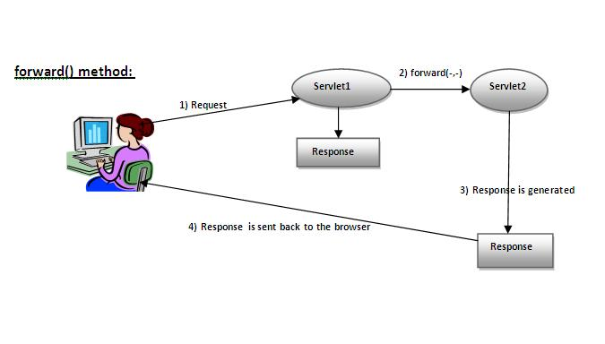
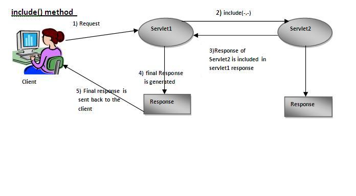
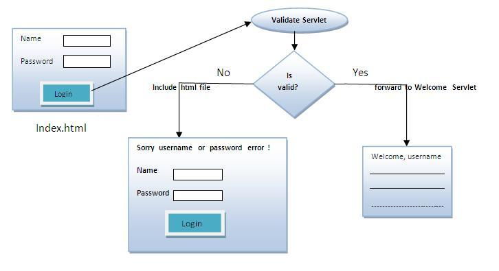

`RequestDispatcher`接口提供将请求转发送到另一个资源的功能，它可能是`html`，`servlet`或`jsp`等。 此接口也可用于包括另一资源的内容。它是servlet协作的一种方式。
在`RequestDispatcher`接口中定义了两种方法。它们分别是
编号|方法|描述
--|--|--
1|`public void forward(ServletRequest request,ServletResponse response)throws|ServletException,java.io.IOException`|将servlet的请求转发到服务器上的另一个资源(servlet，JSP文件或HTML文件)。
2|`public void include(ServletRequest request,ServletResponse response)throws ServletException,java.io.IOException`|在响应中包含资源的内容(servlet，JSP页面或HTML文件)。

如上图所示，第一个`servlet`转发请求到第二个`servlet`的响应发送给客户端。 第一个`servlet`的响应不会显示给用户。

如上图所示，第二个`servlet`的响应将包含在发送给客户端的第一个`servlet`的响应中。

**如何获取`RequestDispatcher`的对象？**
`ServletRequest`接口的`getRequestDispatcher()`方法返回`RequestDispatcher`的对象。
`getRequestDispatcher`方法的语法如下 -
~~~java
public RequestDispatcher getRequestDispatcher(String resource);
~~~
**使用`getRequestDispatcher`方法的示例**
~~~java
RequestDispatcher rd=request.getRequestDispatcher("servlet2");  
//servlet2 is the url-pattern of the second servlet  
rd.forward(request, response);//method may be include or forward/
~~~

# RequestDispatcher接口示例

在这个例子中，创建了以下几个文件：

* index.html：用于从用户处获取输入。
* Login.java：用于处理响应的servlet类。如果用户输入的密码是`mypasswd`，它会将请求转发给`WelcomeServlet`。
* WelcomeServlet.java：用于显示欢迎消息的servlet类。
* web.xml：包含有关servlet信息的部署描述符文件

工作流程:

forward.html
~~~html
<!DOCTYPE html>
<html lang="en" xmlns="http://www.w3.org/1999/html">
<head>
    <meta charset="UTF-8">
    <title>登录</title>
</head>
<body>
    

        <form action="login" method="post">
            用户名:<input type="text" name="userName"> 
            密码:<input type="password" name="userPwd"> 
            <input type="submit" value="登录">
        </form>
    

</body>
</html>
~~~
Login.java
~~~java
public class Login extends HttpServlet {
    private static final long serialVersionUID = 1L;

    @Override
    public void doPost(HttpServletRequest request, HttpServletResponse response) throws IOException, ServletException {
        // 设置服务器端编码
        response.setCharacterEncoding("utf-8");
        // 设置响应内容类型器
        response.setContentType("text/html;charset=utf-8");
        // 获取响应输出对象
        PrintWriter out = response.getWriter();

        String name = request.getParameter("userName");
        String password = request.getParameter("userPwd");

        //判断用户输入的用户名和密码是否正确
        if (password.equals("password")&&name.equals("admin")){
            RequestDispatcher requestDispatcher = request.getRequestDispatcher("WelcomeServlet/welcome");
            System.out.println("Username is "+ name);
            requestDispatcher.forward(request,response);
        }
    }
}
~~~
**注意:getRequestDispatcher()里面的参数要和你要重定向的java程序在web.xml下的配置路径一致**

# **注意:关于url路径问题 在html中href和action中第一个字符不能是'/',有'/'就会覆盖工程目录,而web.xml中的路径第一个字符一定加'/',不加会报错,它不会覆盖工程目录而是把它加在后面**

web.xml
~~~xml
<?xml version="1.0" encoding="UTF-8"?>

<web-app xmlns:xsi="http://www.w3.org/2001/XMLSchema-instance"
         xmlns="http://xmlns.jcp.org/xml/ns/javaee"
         xsi:schemaLocation="http://xmlns.jcp.org/xml/ns/javaee http://xmlns.jcp.org/xml/ns/javaee/web-app_3_1.xsd"
         id="WebApp_ID" version="3.1">
    <display-name>ServletRequest</display-name>
    <welcome-file-list>
        <welcome-file>forward.html</welcome-file>
        <welcome-file>head.html</welcome-file>
        <welcome-file>index.html</welcome-file>
        <welcome-file>index.jsp</welcome-file>
    </welcome-file-list>
    <servlet>
        <servlet-name>Login</servlet-name>
        <servlet-class>Login</servlet-class>
    </servlet>
    <servlet-mapping>
        <servlet-name>Login</servlet-name>
        <url-pattern>/login</url-pattern>
    </servlet-mapping>
    <servlet>
        <servlet-name>WelcomeServlet</servlet-name>
        <servlet-class>WelcomeServlet</servlet-class>
    </servlet>
    <servlet-mapping>
        <servlet-name>WelcomeServlet</servlet-name>
        <url-pattern>/WelcomeServlet/welcome</url-pattern>
    </servlet-mapping>
</web-app>
~~~

