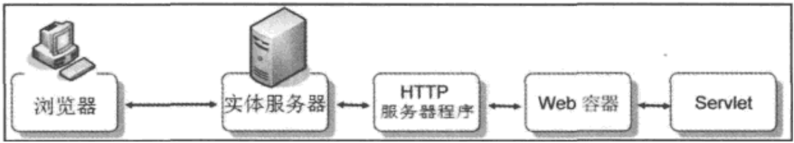
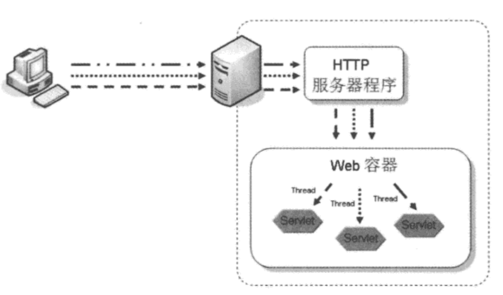

# WEB 容器的概念
当开始编写Servlet/JSP程序时，必须开始接触容器（Container）的概念，容器这个名词也用在如List、set这类的collection上，也就是用来持有、保存对象的集合（Collection）对象。对于编写Servle/JSP来说，容器的概念更广，它不仅持有对象，还负责对象的生命周期与相关服务的连接。

在具体层面，容器说穿了，其实就是一个用Java写的程序，运行于JVM之上，不同类型的容器会负责不同的工作，若以Servlet/JSP运行的Web 容器（Web Container）来说，也是一个Java写的程序。将来编写Servlet时，会接触attpservletRequest、BttpServletResponse等对象，想想看，HTTP那些文字性的通信协议，如何变成Servlet/JSP中可用的Java对象，其实就是容器为你剖析与转换。

在抽象层面，可以将Web容器视为运行Servlet/JSP的HTTP服务器。就如同Java程序仅认得JVM这个操作系统，Servlet/JSP程序在抽象层面上，也仅认得Web容器这个概念上的HTTP服务器，只要写的Servlet/JSP符合Web容器的标准规范，Servlet/JSP就可以在各种不同厂商实现的Web容器上运行，而不用理会底层真正的HTTP 服务器是什么。

# 请求/响应的基本例子:
1. 客户端（大部分情况下是浏览器）对Web服务器发出HTTP请求。
2. HTTP服务器收到HTTP请求，将请求转由Web容器处理，Web容器会剖析HTTP请求内容，创建各种对象（如ttpServletRequest、BttpServletResponse、ttpsession等）。
3. Web容器由请求的URL决定要使用哪个Servlet来处理请求（事先由开发人员定义）。
4. Servlet 根据请求对象（HttpservletRequest）的信息决定如何处理，通过响应对象（HttpservletResponse）来创建响应。
5. Web容器与HTTP服务器沟通，Web服务器将响应转换为HTTP响应并传回客户端。

# WEB容器的运行
当一个请求来的时候,WEB容器会为每个请求分配一个线程.

然而要注意的是，Web容器可能会使用同一个Servlet实例来服务多个请求。也就是说，多个请求下，就相当于多个线程在共享存取一个对象，因此得注意线程安全（Thread-safe）的问题，避免引发数据错乱，如A用户登录后看到B用户的数据这类问题。

