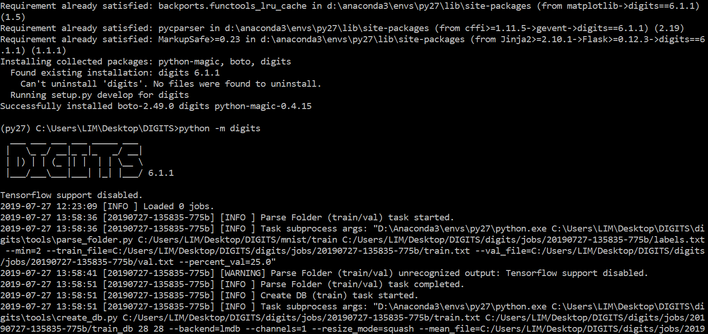
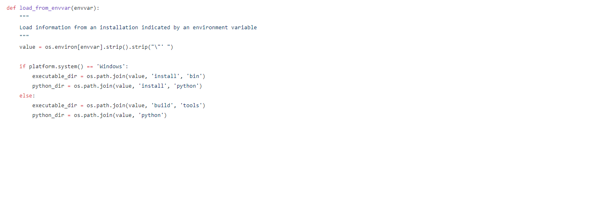

# 1.anaconda创建一个python2.7的虚拟环境py27
由于digits官方还是python2.7的版本，这是很蛋疼的一点，后面的安装各种依赖的时候非常的酸爽。由于是python2.7的环境，因此还需要下载一个[用于Python 2.7的Microsoft Visual C ++编译器](https://www.microsoft.com/en-us/download/details.aspx?id=44266)
# 2.安装CUDA8和对应的cuDNN
参考博客
[https://blog.csdn.net/c20081052/article/details/86683446](https://blog.csdn.net/c20081052/article/details/86683446)
# 3. caffe的安装
这一步是整个过程中最难和复杂的一步，一开始我尝试的是编译caffe，但是我试了好久还是没用成功。但是我经过不懈的搜索终于在知乎上找到了一个编译好的caffe，在这里非常的感谢这位大神。
[图形界面交互式机器学习：DIGITS搭建](https://zhuanlan.zhihu.com/p/54767210)
## 3.1 下载编译好的caffe
按照上面链接给出的百度云盘下载完成后解压，解压后的目录结构如下：
caffe
├─bin
├─include
├─lib
├─python
└─share
## 3.2 把编译好的caffe导入创建好的py27环境中
把caffe则整个文件夹复制到py27环境中(就相当于pip下载的包一样)
把它导入到D:\Anaconda3\envs\py27\Lib\site-packages(此文件夹是专门存放第三方包的)这个文件夹下面
## 3.3 添加一个CAFFE_ROOT的环境变量
在系统环境变量里面添加一个CAFFE_ROOT的环境变量并写入caffe的位置D:\Anaconda3\envs\py27\Lib\site-packages\caffe。
# 4. 安装digits
## 4.1 下载digits源码
~~~bash
git clone https://github.com/NVIDIA/DIGITS.git
~~~
**以下都是在事先创建好的py27虚拟环境中执行的**
## 4.2 安装包
~~~bash
pip install -r requirements.txt
~~~
由于是python2.7的环境因此肯定有很多包是下载不下来的，这时我就是把它后面的版本号都去掉了，把pydot改成了pydotplus，其实我不知道我这样搞对后面有没有什么影响，但是最后我是运行出来了。
## 4.3 执行 python -m pip install -e $DIGITS_ROOt
其中$DIGITS_ROO替换为你的digits根目录。执行完这一步之后会在根目录生成一个digits.egg-info目录。
## 4.4 运行digits
~~~bash
python -m digits
~~~

如果这样就表示成功了。
接下来就在浏览器中输入localhost:5000,就可以看到这样的界面了。

## 安装digits这一步遇到的问题
如果你前面的包都下载好了，在这里你会遇到一个关于caffe的问题，这是因为跟目录结构有关。它会报一个找不到caffe和pycaffe的错误。这里我把它的源码稍微修改了一下，修改的位置是DIGITS\digits\config\caffe.py
这是我修改的地方
这是源码
我把那两个install去掉了，如果不去掉的话它会去install/bin和install/python找caffe.exe和pycaffe.exe，而我就没有install这个父目录。

# 5. 训练mnist
参考下面这篇博客
[使用DIGITS训练基于mnist数据集的手写数字识别模型](https://piaoling199.github.io/2018/11/14/%E4%BD%BF%E7%94%A8DIGITS%E8%AE%AD%E7%BB%83%E5%9F%BA%E4%BA%8Emnist%E6%95%B0%E6%8D%AE%E9%9B%86%E7%9A%84%E6%89%8B%E5%86%99%E6%95%B0%E5%AD%97%E8%AF%86%E5%88%AB%E6%A8%A1%E5%9E%8B/)

**以下命令用到python的都是在py27虚拟环境中执行**
## 5.1 下载mnist数据集
1. 首先在digits根目录下新建一个mnist目录
   
2. 在digits根目录下执行
   ~~~bash
   python -m digits.download_data mnist ./mnist
   ~~~
## 5.2 导入刚才创建好的mnist数据集的train
## 5.3 建立一个模型训练