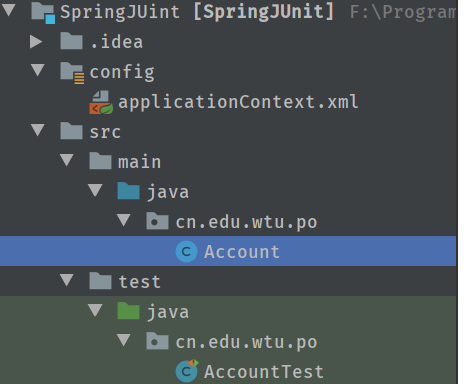

# Spring学习笔记（六）Spring整合Junit

---
- [Spring学习笔记（六）Spring整合Junit](#spring%e5%ad%a6%e4%b9%a0%e7%ac%94%e8%ae%b0%e5%85%adspring%e6%95%b4%e5%90%88junit)
- [1、Spring 整合 Junit 的配置过程](#1spring-%e6%95%b4%e5%90%88-junit-%e7%9a%84%e9%85%8d%e7%bd%ae%e8%bf%87%e7%a8%8b)
- [2、项目结构](#2%e9%a1%b9%e7%9b%ae%e7%bb%93%e6%9e%84)
- [3、实体类](#3%e5%ae%9e%e4%bd%93%e7%b1%bb)
- [4、测试类](#4%e6%b5%8b%e8%af%95%e7%b1%bb)
- [5、配置applicationContext.xml](#5%e9%85%8d%e7%bd%aeapplicationcontextxml)

---

# 1、Spring 整合 Junit 的配置过程

1. 导入 Spring 整合 Junit 的 jar ( 坐标 )
 spring-test-x.x.x.RELEASE.jar
2. 使用 Junit 提供的一个注解把原有的 main 方法替换了，替换成 Spring 提供的@Runwith

3. 告知 Spring 的运行器， Spring 和 ioc 创建是基于 xml 还是注解的，并且说明位置，用到的注解如下

    @ContextConfiguration

    Locations : 指定 xml 文件的位置，加上 classpath 关键字，表示在类路径下

    classes : 指定注解类所在地位置

4. 使用@Autowired 给测试类中的变量注入数据

# 2、项目结构



# 3、实体类
- Account.java
```java
@Component
public class Account {
    @Value("1")
    private Integer id;
    @Value("Tom")
    private String name;
    @Value("34567")
    private Float money;

    public Integer getId() {
        return id;
    }

    public void setId(Integer id) {
        this.id = id;
    }

    public String getName() {
        return name;
    }

    public void setName(String name) {
        this.name = name;
    }

    public Float getMoney() {
        return money;
    }

    public void setMoney(Float money) {
        this.money = money;
    }

    @Override
    public String toString() {
        return "Account{" +
                "id=" + id +
                ", name='" + name + '\'' +
                ", money=" + money +
                '}';
    }
}
```
# 4、测试类
- AccountTest.java
```java
@RunWith(SpringJUnit4ClassRunner.class)
@ContextConfiguration(locations = "classpath:applicationContext.xml")
public class AccountTest {

    @Autowired
    private Account account;

    @Test
    public void testAccount(){
        System.out.println(account);
    }
}
```

# 5、配置applicationContext.xml
```xml
<?xml version="1.0" encoding="UTF-8"?>
<beans xmlns="http://www.springframework.org/schema/beans"
       xmlns:xsi="http://www.w3.org/2001/XMLSchema-instance"
       xmlns:context="http://www.springframework.org/schema/context"
       xsi:schemaLocation="http://www.springframework.org/schema/beans http://www.springframework.org/schema/beans/spring-beans.xsd http://www.springframework.org/schema/context http://www.springframework.org/schema/context/spring-context.xsd">
    <!-- 开启组件扫描 -->
    <context:component-scan base-package="cn.edu.wtu"></context:component-scan>
</beans>
```