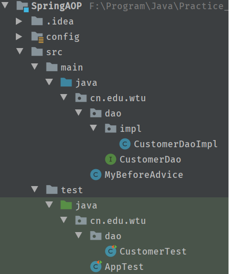
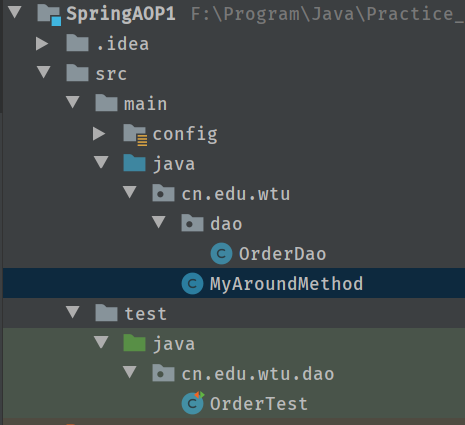

# Spring学习笔记(9) Spring中的AOP
---

- [Spring 的传统 AOP](#spring-的传统-aop)
- [Spring 中的切面类型](#spring-中的切面类型)
- [Spring 的 AOP 的开发](#spring-的-aop-的开发)
    - [一.不带有切点的切面](#一不带有切点的切面)
        - [项目目录](#项目目录)
        - [1.导入相应的jar包](#1导入相应的jar包)
        - [2.编写被代理的对象](#2编写被代理的对象)
        - [3.编写增强代码](#3编写增强代码)
        - [4.生成代理](#4生成代理)
        - [5.测试](#5测试)
    - [二.带有切点的切面](#二带有切点的切面)
        - [项目结构](#项目结构)
        - [1.创建被代理对象](#1创建被代理对象)
        - [2.编写增强的类](#2编写增强的类)
        - [3.生成代理](#3生成代理)
        - [4.测试类](#4测试类)

---
# Spring 的传统 AOP

AOP:不是由 Spring 定义.而是AOP 联盟的组织定义.
Spring 中的通知:(增强代码)
* 前置通知 `org.springframework.aop.MethodBeforeAdvice`
    **在目标方法执行前实施增强**
* 后置通知 `org.springframework.aop.AfterReturningAdvice`
    **在目标方法执行后实施增强**
* 环绕通知 `org.aopalliance.intercept.MethodInterceptor`
    **在目标方法执行前后实施增强**
* 异常抛出通知 `org.springframework.aop.ThrowsAdvice`
    **在方法抛出异常后实施增强**
* 引介通知 `org.springframework.aop.IntroductionInterceptor`
    **在目标类中添加一些新的方法和属性**

# Spring 中的切面类型

* Advisor : Spring 中传统切面.
  * Advisor:都是有一个切点和一个通知组合.
  * Aspect:多个切点和多个通知组合.

* Advisor : 代表一般切面， Advice 本身就是一个切面， 对目标类所有方法进行拦截(*不带有切点的切面.针对所有方法进行拦截*)

* PointcutAdvisor : 代表具有切点的切面， 可以指定拦截目标类哪些方法(带有切点的切面,针对某个方法进行拦截)

* IntroductionAdvisor : 代表引介切面， 针对引介通知而使用切面

# Spring 的 AOP 的开发

## 一.不带有切点的切面
就是对所有的方法进行增强

### 项目目录


### 1.导入相应的jar包
- pom.xml
```xml
<properties>
    <project.build.sourceEncoding>UTF-8</project.build.sourceEncoding>
    <maven.compiler.source>1.7</maven.compiler.source>
    <maven.compiler.target>1.7</maven.compiler.target>
    <!-- spring版本号 -->
    <spring.version>5.1.5.RELEASE</spring.version>
  </properties>

  <dependencies>
    <dependency>
      <groupId>junit</groupId>
      <artifactId>junit</artifactId>
      <version>4.12</version>
      <scope>test</scope>
    </dependency>
    <!-- 1.Spring核心依赖 -->
    <dependency>
      <groupId>org.springframework</groupId>
      <artifactId>spring-core</artifactId>
      <version>${spring.version}</version>
    </dependency>
    <dependency>
      <groupId>org.springframework</groupId>
      <artifactId>spring-beans</artifactId>
      <version>${spring.version}</version>
    </dependency>
    <dependency>
      <groupId>org.springframework</groupId>
      <artifactId>spring-context</artifactId>
      <version>${spring.version}</version>
    </dependency>
    <dependency>
      <groupId>org.springframework</groupId>
      <artifactId>spring-expression</artifactId>
      <version>${spring.version}</version>
    </dependency>
    <dependency>
      <groupId>org.springframework</groupId>
      <artifactId>spring-test</artifactId>
      <version>${spring.version}</version>
    </dependency>
    <dependency>
      <groupId>org.springframework</groupId>
      <artifactId>spring-aop</artifactId>
      <version>${spring.version}</version>
    </dependency>

    <!-- https://mvnrepository.com/artifact/aopalliance/aopalliance -->
    <dependency>
      <groupId>aopalliance</groupId>
      <artifactId>aopalliance</artifactId>
      <version>1.0</version>
    </dependency>

  </dependencies>
```

### 2.编写被代理的对象
- CustomerDao接口
```java
public interface CustomerDao {
    /**
     * 增加
     */
    public void add();

    /**
     * 更新
     */
    public void update();

    /**
     * 删除
     */
    public void delete();

    /**
     * 查找
     */
    public void find();
}
```
- CustomerDaoImpl实现类
```java
public class CustomerDaoImpl implements CustomerDao {
    /**
     * 增加
     */
    @Override
    public void add() {
        System.out.println("添加客户");
    }

    /**
     * 更新
     */
    @Override
    public void update() {
        System.out.println("更新客户");
    }

    /**
     * 删除
     */
    @Override
    public void delete() {
        System.out.println("删除客户");
    }

    /**
     * 查找
     */
    @Override
    public void find() {
        System.out.println("查找客户");
    }
}
```

### 3.编写增强代码
- MyBeforeAdvice
```java
public class MyBeforeAdvice implements MethodBeforeAdvice {
    /**
     * @param method 执行的方法
     * @param objects 参数
     * @param o 目标对象
     * @throws Throwable
     */
    @Override
    public void before(Method method, Object[] objects, Object o) throws Throwable {
        System.out.println("前置增强(执行目标对象的方法前)....");
    }
}
```

### 4.生成代理

* 生成代理Spring基于proxyFactoryBean类.底层自动选择使用JDK的动态代理还是CGLIB的代理.
* 属性：
        `target`：代理的目标对象
        `proxyInterfaces`：代理要实现的接口
        如果多个接口可以使用以下格式赋值
        ``xml
        \<list>
        \<value>\</value>
        \</list>
        ```
        `proxyTargetclass`：是否对类代理而不是接口，设置为true时，使用CGLib代理interceptorNames：需要织入目标的Advice `singleton`：返回代理是否为单实例，默认为单例
        `optimize`：当设置为true时，强制使用CGLib

- applicationContext.xml
```xml
<!--spring通过配置生成代理,不带有切点的切面-->
    <!--目标对象(被增强的对象)-->
    <bean name="customerDao" class="cn.edu.wtu.dao.impl.CustomerDaoImpl"></bean>
    <!--定义增强-->
    <bean name="beforeAdvice" class="cn.edu.wtu.MyBeforeAdvice"></bean>

    <!--spring 支持配置生成代理-->
    <bean id="customerDaoProxy" class="org.springframework.aop.framework.ProxyFactoryBean">
        <!--设置目标对象-->
        <property name="target" ref="customerDao"/>
        <!--设置实现的接口 value中要写接口的全路径-->
        <property name="proxyInterfaces" value="cn.edu.wtu.dao.CustomerDao"/>
        <!--需要使用value:要的名称-->
        <property name="interceptorNames" value="beforeAdvice"/>
    </bean>
```

### 5.测试
- CustomerTest
```java
@RunWith(SpringJUnit4ClassRunner.class)
@ContextConfiguration(locations = "classpath:applicationContext.xml")
public class CustomerTest {
    // 注入代理对象
    @Resource(name = "customerDaoProxy")
    private CustomerDao customerDao;

    @Test
    public void testCustomer(){
        customerDao.add();
        customerDao.update();
        customerDao.delete();
        customerDao.find();
    }
}
```

## 二.带有切点的切面
 针对目标对象的某些方法进行增强

`PointcutAdvisor `接口：
`DefaultPointcutAdvisor` 最常用的切面类型，它可以通过任意Pointcut和Advice组合定义切面
`RegexpMethodpointcutAdvisor `构造正则表达式切点切面（建议）

### 项目结构



### 1.创建被代理对象
- OrderDao
```java
public class OrderDao {
    public void add(){
        System.out.println("添加订单");
    }
    public void update(){
        System.out.println("修改订单");
    }
    public void delete(){
        System.out.println("删除订单");
    }
    public void find(){
        System.out.println("查询订单");
    }
}
```
### 2.编写增强的类
- MyAroundMethod
```java
public class MyAroundMethod implements MethodInterceptor {
    @Override
    public Object invoke(MethodInvocation methodInvocation) throws Throwable {
        System.out.println("环绕前增强");
        //执行目标对象的方法
        Object result = methodInvocation.proceed();
        System.out.println("环绕后增强");
        System.out.println("--------------");
        return result;
    }
}
```

### 3.生成代理
- applicationContext.xml
```xml
<?xml version="1.0" encoding="UTF-8"?>
<beans xmlns="http://www.springframework.org/schema/beans"
       xmlns:xsi="http://www.w3.org/2001/XMLSchema-instance"
       xsi:schemaLocation="http://www.springframework.org/schema/beans http://www.springframework.org/schema/beans/spring-beans.xsd">
    <!-- 通过spring配置文件生成代理-->
    <!--目标对象(被增强对象)-->
    <bean id="orderDao" class="cn.edu.wtu.dao.OrderDao"></bean>
    <!--定义增强-->
    <bean id="aroundAdvice" class="cn.edu.wtu.MyAroundMethod"></bean>
    <!--定义切点切面(哪些方法要增强)-->
    <bean id="myPointcutAdvisor" class="org.springframework.aop.support.RegexpMethodPointcutAdvisor">
        <!--应用增强-->
        <property name="advice" ref="aroundAdvice"/>
    </bean>

    <!--定义生成代理对象-->
    <bean id="orderDaoProxy" class="org.springframework.aop.framework.ProxyFactoryBean">
        <!--配置目标对象-->
        <property name="target" ref="orderDao"/>
        <!--针对类的代理-->
        <property name="proxyTargetClass" value="true"/>
        <!--在目标应用上增强-->
        <property name="interceptorNames" value="myPointcutAdvisor"/>
    </bean>
</beans>
```

### 4.测试类
- OrderTest
```java
@RunWith(SpringJUnit4ClassRunner.class)
@ContextConfiguration(locations = "classpath:applicationContext.xml")
public class OrderTest {
    @Resource(name = "orderDaoProxy")
    OrderDao orderDao;

    @Test
    public void testDao(){
        orderDao.add();
        orderDao.update();
        orderDao.delete();
        orderDao.find();
    }
}
```

# 自动代理

前面的案例中， 每个代理都是通过 `ProxyFactoryBean` 织入切面代理， 在实际开发中， 非常多的 `Bean` 每个都配置`ProxyFactoryBean` 开发维护量巨大

自动创建代理(基于后处理 Bean【类创建的过程中完成的增强】.在 Bean 创建的过程中完成的增强.生成 Bean就是代理.)

上面传统， 就是得先创建被代理对象（目标对象） ， 然后根据被代理对象， 创建代理对象

* `BeanNameAutoProxyCreator`根据 Bean 名称创建代理
* `DefaultAdvisorAutoProxyCreator` 根据 `Advisor` 本身包含信息创建代理
* `AnnotationAwareAspectJAutoProxyCreator` 基于 `Bean` 中的 `AspectJ `注解进行自动代理

## BeanNameAutoProxyCreator
按名称生成代理

### 1.applicationContext.xml 的配置
