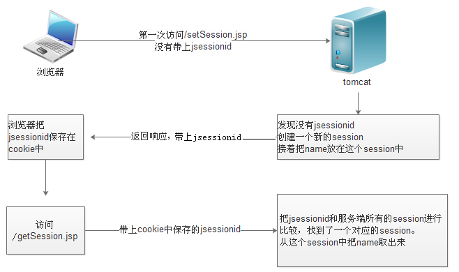

会话指的是从用户打开浏览器访问一个网站开始，无论在这个网站中访问了多少页面，点击了多少链接，都属于同一个会话。 直到该用户关闭浏览器为止，都属于同一个会话。

# 如果没有cookie，session如何工作

如果浏览器把cookie功能关闭，那么服务端就无法获取jsessionid,每一次访问，都会生成一个新的session对象。

为了解决这个问题，可以使用
~~~java
response.encodeURL("getSession.jsp")
~~~

`response.encodeURL`方法会把`getSession.jsp`这个url转换为
~~~url
getSession.jsp;jsessionid=22424AEA86ADBE89F335EEB649D997A8
~~~
通过这个方式，提交`jsessionid`到服务器。 服务器根据这个`jsessionid`匹配到对应的`session`. 与`session`相关的功能，就可以正常工作了。

# session的有效期
比如登录一个网站，登录后，在短时间内，依然可以继续访问而不用重新登录。

但是较长时间不登录，依然会要求重新登录，这是因为服务端的session在一段时间不使用后，就失效了。

这个时间，在Tomcat默认配置下，是30分钟。

可以通过 `tomcat/conf/web.xml `中的`session-config `配置进行调整