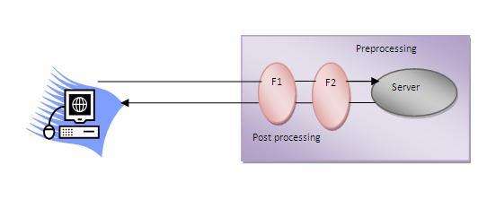

# 什么是过滤器
过滤器是在请求的预处理和后处理时调用的对象。
主要用于**执行转换**，**日志记录**，**压缩**，**加解密**，**输入验证**等过滤任务。
servlet过滤器是可插拔的，即它在`web.xml`文件中定义，如果从`web.xml`文件中删除过滤项，则过滤器将被自动删除，因此不需要手动更改`Servlet`。所以过滤器维护成本会比较低。

参考模型图 

   注意：与Servlet不同，一个过滤器不依赖于另一个过滤器。

# 过滤器的使用

* 记录所有传入的请求
* 记录来自标计算机的IP地址的请求
* 转变/转换
* 数据压缩
* 加密和解密
* 输入验证等

# 过滤器的优点

* 过滤器是可插拔的。
* 一个过滤器不依赖于另一个资源。
* 维护少，比较容易维护。

# 过滤器API
像Servlet一样，过滤器也有自己的**API**。 `javax.servlet`包中包含Filter API的三个接口，它们分别如下所示 

* Filter
* FilterChain
* FilterConfig

## Filter接口
要创建一个过滤器，必须要实现`Filter`接口。`Filter`接口为过滤器提供了生命周期方法。
方法|描述
--|--
`public void init(FilterConfig config)`|`init()`方法只被调用一次，用于初始化过滤器。
`public void doFilter(HttpServletRequest request,HttpServletResponse response, FilterChain chain)`|当用户请求过滤器所映射到资源时，会调用`doFilter()`方法，它用于执行过滤任务。
`public void destroy()`|当过滤器从服务中取出时，调用此方法(仅一次)。

## FilterChain接口
`FilterChain`对象负责调用链中的下一个过滤器或资源。对象在`Filter`接口的 `doFilter`方法中传递。 `FilterChain`接口只包含一个方法：
* `public void doFilter(HttpServletRequest request，HttpServletResponse response)`：
  它将控件传递给下一个过滤器或资源。
## 如何定义过滤器
我们可以使用与servlet相同方式来定义过滤器。下面来看看过滤器和过滤器映射的元素。在`web.xml`文件配置如下 
~~~xml
<web-app>  

<filter>  
  <filter-name>...</filter-name>  
  <filter-class>...</filter-class>  
</filter>  

<filter-mapping>  
  <filter-name>...</filter-name>  
  <url-pattern>...</url-pattern>  
</filter-mapping>  

</web-app>
~~~
对于映射过滤器，可以使用`url-pattern`或`servlet-name`。 `url-pattern`元素比`servlet-name`元素具有优势，即它可以应用于`servlet`，`JSP`或`HTML`资源。

# 过滤器的示例

MyFilter.java
~~~java
public class MyFilter implements Filter {

    @Override
    public void init(FilterConfig filterConfig) throws ServletException {

    }

    @Override
    public void doFilter(ServletRequest servletRequest, ServletResponse servletResponse, FilterChain filterChain) throws IOException, ServletException {
        // 设置服务器端的内容类型
        servletResponse.setContentType("text/html");
        // 设置服务器端的编码
        servletResponse.setCharacterEncoding("utf-8");
        // 设置客户端的编码
        servletRequest.setCharacterEncoding("utf-8");
        // 获取服务器端的输出对象
        PrintWriter out = servletResponse.getWriter();

        out.println("过滤器调用之前 ");

        filterChain.doFilter(servletRequest,servletResponse);

        out.println("过滤器调用之后 ");
    }

    @Override
    public void destroy() {

    }
}
~~~
MyFilterServlet.java
~~~java
public class MyFilterServlet extends HttpServlet {
    @Override
    public void doGet(HttpServletRequest request, HttpServletResponse response) throws IOException {
        // 设置服务器端编码
        response.setCharacterEncoding("UTF-8");
        // 设置服务器端内容类型
        response.setContentType("text/html;charset=UTF-8");
        // 设置客户端编码
        request.setCharacterEncoding("UTF-8");
        // 获取服务器端输出对象
        PrintWriter out = response.getWriter();
        out.print("  -- 这是一个简单的测试Servlet. ");
    }
}
~~~
Filter.html
~~~html
<!DOCTYPE html>
<html lang="en">
<head>
    <meta charset="UTF-8">
    <title>过滤器的简单示例</title>
</head>
<body>
    

        <a href="myFilterServlet">查看过滤器调用信息</a>
    

</body>
</html>
~~~
web.xml
~~~xml
<?xml version="1.0" encoding="UTF-8"?>

<web-app xmlns:xsi="http://www.w3.org/2001/XMLSchema-instance"
         xmlns="http://xmlns.jcp.org/xml/ns/javaee"
         xsi:schemaLocation="http://xmlns.jcp.org/xml/ns/javaee http://xmlns.jcp.org/xml/ns/javaee/web-app_3_1.xsd"
         id="WebApp_ID" version="3.1">
    <display-name>ServletRequest</display-name>
    <welcome-file-list>
        <welcome-file>Filter.html</welcome-file>
    </welcome-file-list>
    <servlet>
        <servlet-name>MyFilterServlet</servlet-name>
        <servlet-class>MyFilterServlet</servlet-class>
    </servlet>
    <servlet-mapping>
        <servlet-name>MyFilterServlet</servlet-name>
        <url-pattern>/myFilterServlet</url-pattern>
    </servlet-mapping>
    <filter>
        <filter-name>MyFilter</filter-name>
        <filter-class>MyFilter</filter-class>
    </filter>
    <filter-mapping>
        <filter-name>MyFilter</filter-name>
        <url-pattern>/myFilterServlet</url-pattern>
    </filter-mapping>
<web-app>
~~~