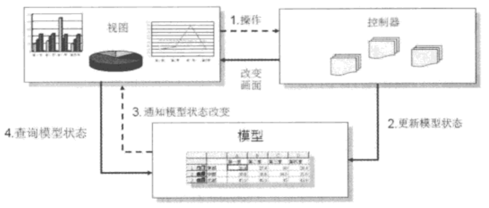

传统的桌面应用程序的MVC架构

然而，桌面应用程序上的MVC设计方式，有个与Web应用程序决定性的不同。
还记得先前谈过，Web应用程序是基于HTTP，必须基于请求/响应模型，没有请求就不会有响应，也就是HTTP服务器不可能主动对浏览器发出响应，也就是在上图中第3点，在HTTP中是做不到的。因此，对MVC的行为作了变化，因而形成所谓的Model2架构。
.jpg)
在Model2的架构上，控制器、模型、视图各负的职责如下

* 控制器：取得请求参数、验证请求参数、转发请求给模型、转发请求给画面，这些都使用程序代码来实现。
* 模型：接受控制器的请求调用，负责处理业务逻辑、负责数据存取逻辑等，这部分还可依应用程序功能，产生各多种不同职责的模型对象，模型使用程序代码来实现。
* 视图：接受控制器的请求调用，会从模型提取运算后的结果，根据需求呈现所需的画面，在职责分配良好的情况下，基本上可作到不出现程序代码，因此不会发生程序代码与HTML混杂在一起的情况。