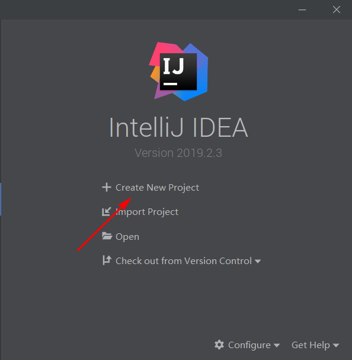
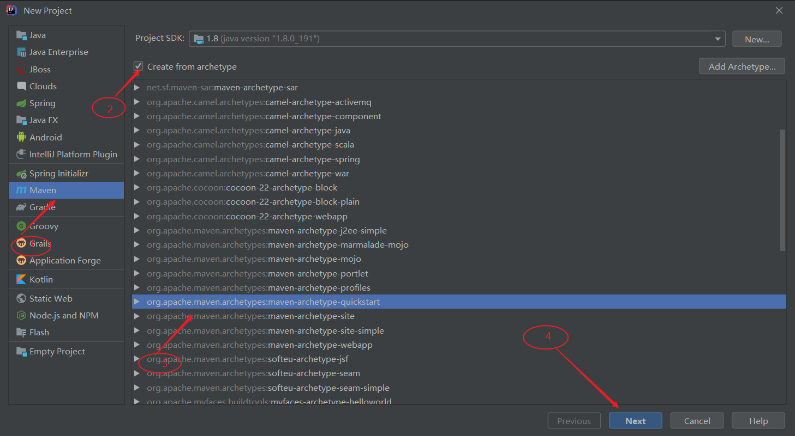
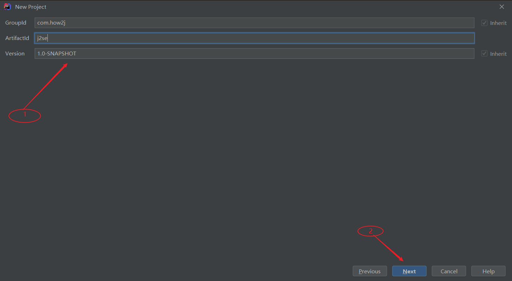
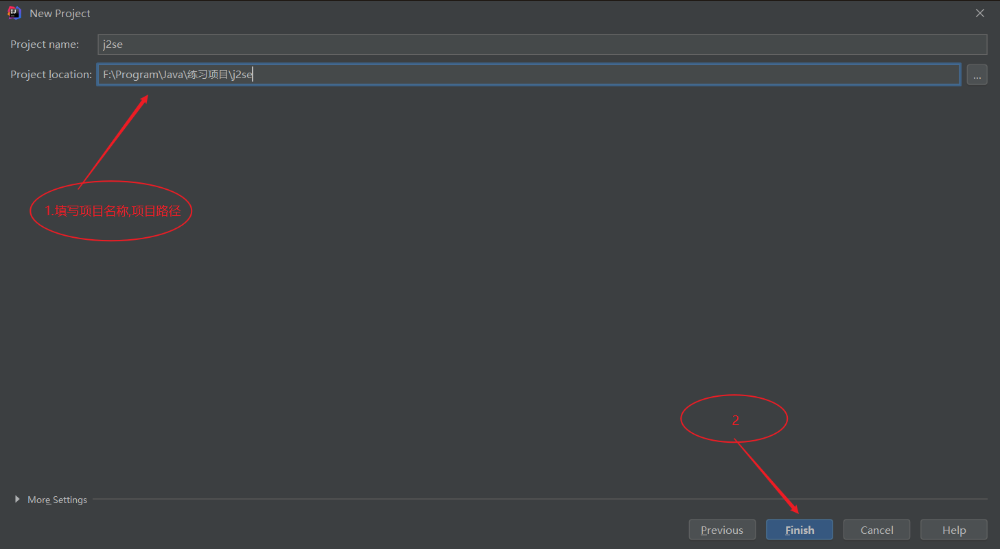
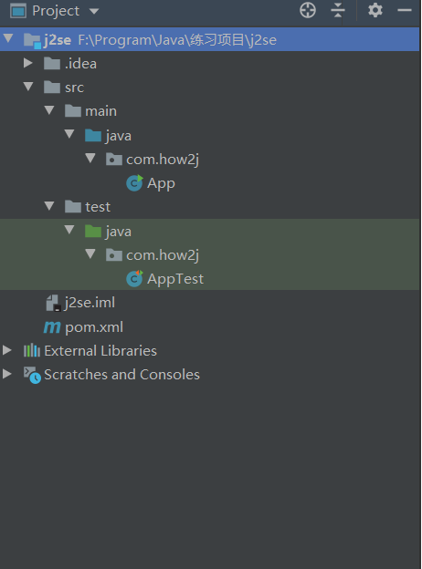

1.用IDEA创建maven项目的方法如下，双击IDEA图标，进入的界面如下，在该页面中，点击箭头所示的“Create New Project”选项

2.在接下来的页面中会直接显示maven选项，由于我们索要创建的是一个最简单的maven项目，所以说我们需要做的是勾选图示所示的“Create From Archetype”复选框，在下面的下拉选项中我们选择“quickstart”，之后点击【Next】

3.在接下来的面板中，我们填写maven的坐标，“groupId”，“artifactId”，以及“version”，其中groupId是公司域名的反写，而artifactId是项目名或模块名，而version就是该项目或模块所对应的版本号。填写完之后，点击【Next】

4.在接下来的面板中选择本地的maven，配置文件和本地仓库路径, 选择完成后点击【Next】

5.在接下来的慢板中填写项目名和项目路径，填写完成后点击【Finish】

6.之后就进入了maven项目的主页面，在这里maven将自动下载一系列的maven依赖，当所有的都自动完成后，创建的maven项目结构如下所示：
