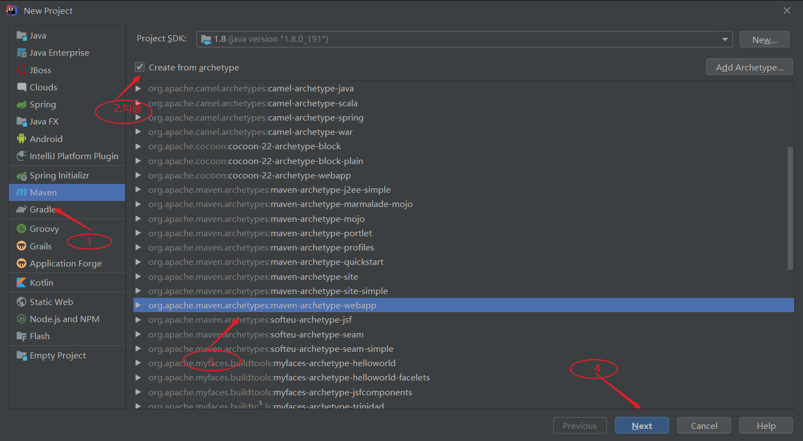
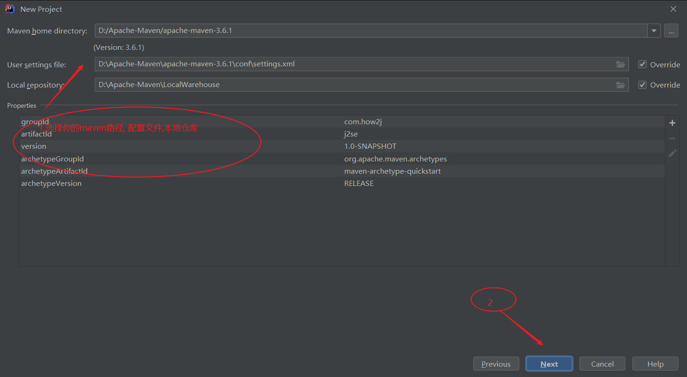
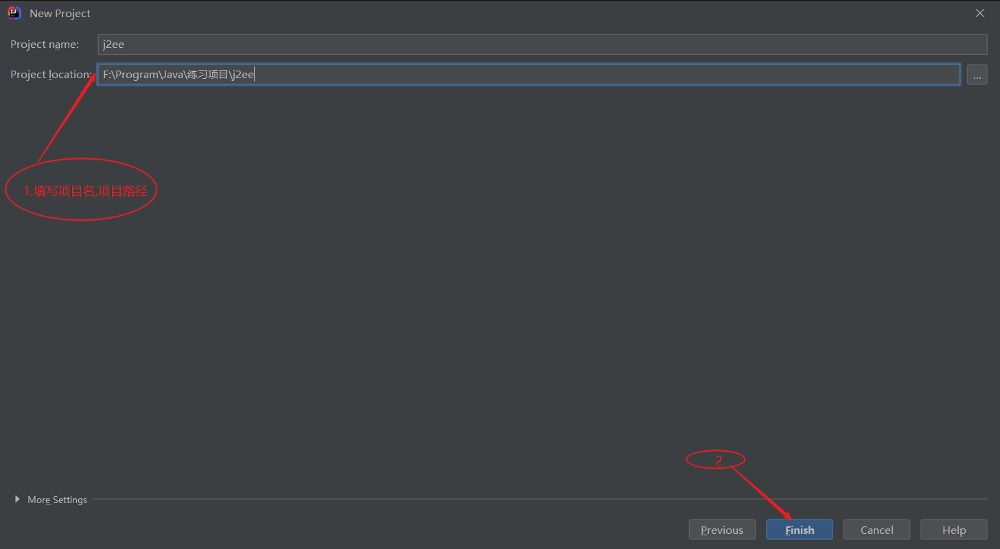
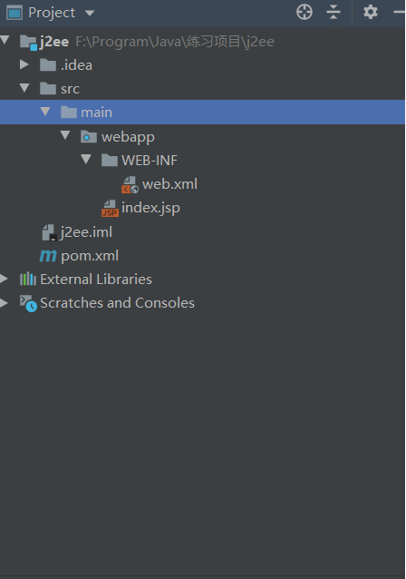
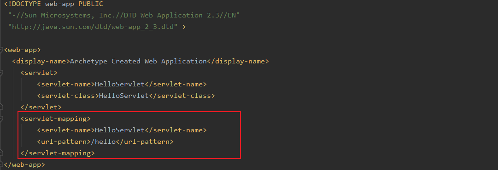
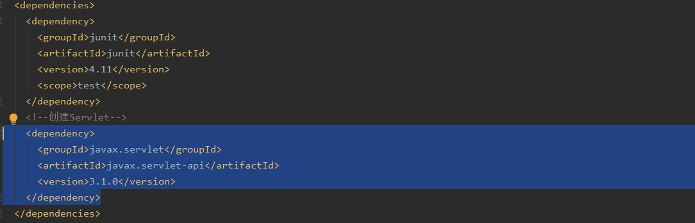
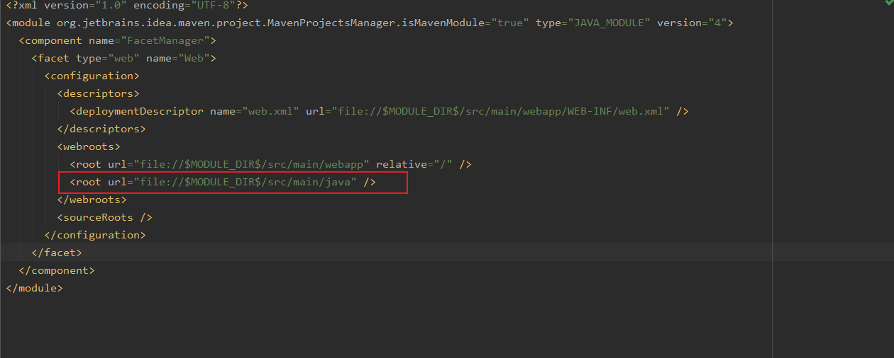

# 1.新建项目 选中maven webapp格式
点击File->New->Project->maven选项，由于我们索要创建的是一个web项目，所以说我们需要做的是勾选图示所示的“Create From Archetype”复选框，在下面的下拉选项中我们选择“maven webapp”，之后点击【Next】

# 2.项目参数
在接下来的面板中，我们填写maven的坐标，“groupId”，“artifactId”，以及“version”，其中groupId是公司域名的反写，而artifactId是项目名或模块名，而version就是该项目或模块所对应的版本号。填写完之后，点击【Next】

# 3.确认Maven路径
在接下来的面板中选择本地的maven，配置文件和本地仓库路径, 选择完成后点击【Next】

# 4.确认项目名称
在接下来的慢板中填写项目名和项目路径，填写完成后点击【Finish】

# 5.项目结构
之后就进入了maven项目的主页面，在这里maven将自动下载一系列的maven依赖，当所有的都自动完成后，创建的maven项目结构如下所示：

# 6.新建java源代码目录
maven web项目默认是没有java源代码目录的，所以需要手动创建，并设置其为源代码目录
右键main目录-> New->Directory->输入java
右键java->Mark Directory as-> Sources Root
这样就创建了存放java源文件的目录了

# 7.创建Servlet
右键java->New->Servlet->HelloServlet
注： 倘若这里看不到Servlet选项，请跳转到[看不到Servlet选项？请更新.iml文件](#jump)

# 8.修改web.xml
修改web.xml,添加/hello映射

# 9.修改pom.xml
修改pom.xml, 添加servletjar包依赖
~~~xml
<dependency>
<groupId>javax.servlet</groupId>
<artifactId>javax.servlet-api</artifactId>
<version>3.1.0</version>
</dependency>
~~~

# 10.配置Tomcat
Tomcat配置和启动涉及多个步骤，请参考IDEA的Tomcat配置:[配置Tomcat](http://how2j.cn/k/idea/idea-tomcat/1361.html)

# 11.启动Tomcat
点击绿色按钮，启动Tomcat

# 12.测试
访问地址，观察到如图所示的界面
http://localhost:8080/j2ee_war/hello

# 13.看不到Servlet选项？请更新.iml文件
在新建Servlet步骤里，右键java源代码目录，无法看到Servlet选型，是因为.iml文件有问题。

1. 在IDEA中打开.iml文件
2. 添加如图所示的代码
~~~xml
<?xml version="1.0" encoding="UTF-8"?>
<module org.jetbrains.idea.maven.project.MavenProjectsManager.isMavenModule="true" type="JAVA_MODULE" version="4">
  <component name="FacetManager">
    <facet type="web" name="Web">
      <configuration>
        <descriptors>
          <deploymentDescriptor name="web.xml" url="file://$MODULE_DIR$/src/main/webapp/WEB-INF/web.xml" />
        </descriptors>
        <webroots>
          <root url="file://$MODULE_DIR$/src/main/webapp" relative="/" />
        </webroots>
      </configuration>
    </facet>
  </component>
</module>
~~~
3. 菜单-File->Close Project
4. 重新打开项目，就能够看到新建Servlet步骤截图里的Servlet选项了
