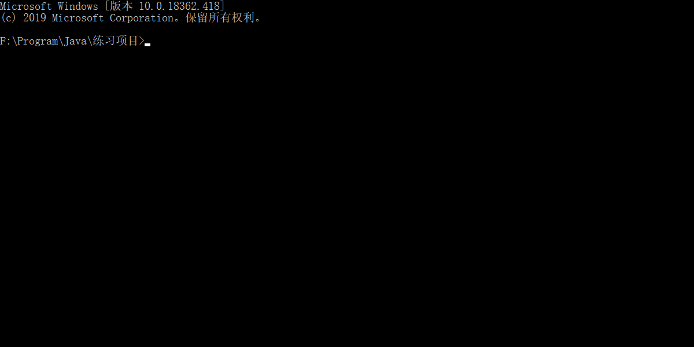
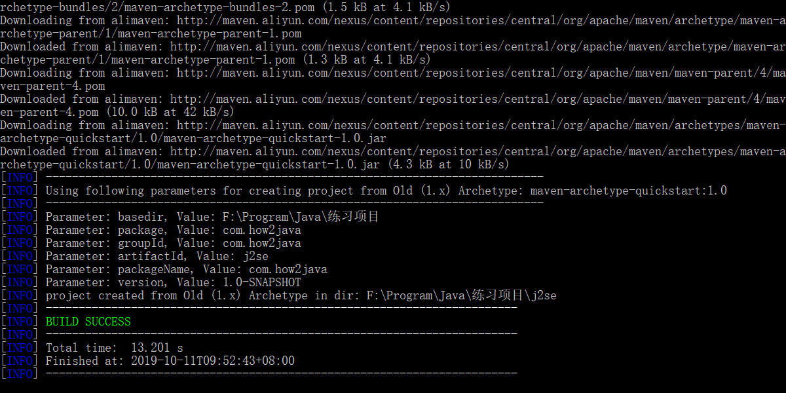
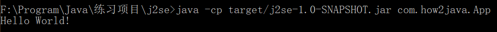

# 1切换到项目目录
使用命令行切换到你要创建maven项目的目录

# 2.创建maven项目
首先确保你切换到的项目目录下没有j2se文件夹，否则会报错
然后执行命令：
~~~
mvn archetype:generate -DgroupId=com.how2java -DartifactId=j2se -DarchetypeArtifactId=maven-archetype-quickstart -DinteractiveMode=false
~~~
* archetype:generate 表示创建个项目
* -DgroupId 项目包名: com.how2java
* -DartifactId 项目名称: j2se
* -DarchetypeArtifactId 项目类型: maven-archetype-quickstart
* -DinteractiveMode:false 表示前面参数都给了，就不用一个一个地输入了

运行成功会看到绿色的BUILD SUCCESS

# 3.运行package命令
首先先切换到j2se目录
~~~
cd j2se
~~~
然后在运行package命令
~~~
mvn package
~~~
最后会看到一个绿色的**BUILD SUCCESS**

package做了很多事情，编译，测试，打包，最后生成了一个**j2se-1.0-SNAPSHOT.jar**包，里面放了APP这个类

# 4.执行jar
~~~
java -cp target/j2se-1.0-SNAPSHOT.jar com.how2java.App
~~~
如图所示，会创建一个标准结构的maven 项目，不仅如此还送了一个App.java。里面输出了一个Hello World!

