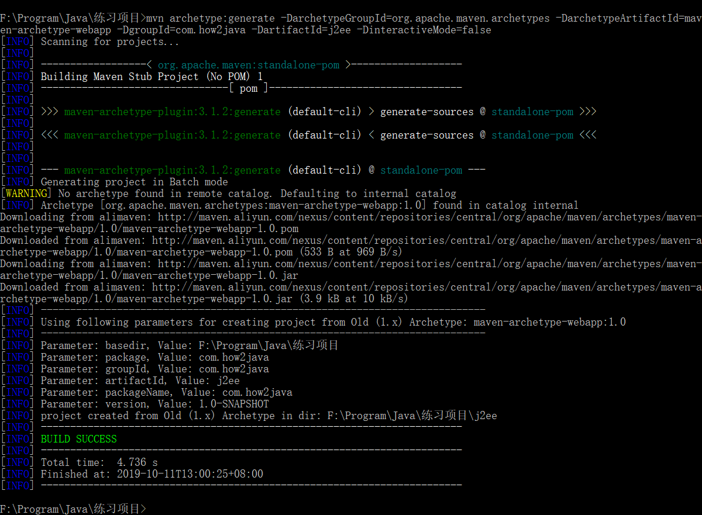

# 1.创建命令
1. 首先切换目录
2. 切换盘符
3. 执行命令（确保你要创建的目录下没有j2ee目录）
~~~
mvn archetype:generate -DarchetypeGroupId=org.apache.maven.archetypes -DarchetypeArtifactId=maven-archetype-webapp -DgroupId=com.how2java -DartifactId=j2ee -DinteractiveMode=false
~~~
这个命令和创建maven java项目中的命令一样，不过类型是从
maven-archetype-quickstart 改成了 maven-archetype-webapp
项目名称从 j2se改成了j2ee而已
