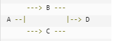

#supper()函数
##描述
1. super() 函数是用于调用父类(超类)的一个方法。
2. super 是用来解决多重继承问题的，直接用类名调用父类方法在使用单继承的时候没问题，但是如果使用多继承，会涉及到查找顺序（MRO）、重复调用（钻石继承）等种种问题。
MRO 就是类的方法解析顺序表, 其实也就是继承父类方法时的顺序表。
##语法(python3)
~~~python
super().xxx
~~~
##例子

使用 super() 可以很好地避免构造函数被调用两次。
~~~python
class A():
    def __init__(self):
        print('enter A')
        print('leave A')

class B(A):
    def __init__(self):
        print('enter B')
        super().__init__()
        print('leave B')

class C(A):
    def __init__(self):
        print('enter C')
        super().__init__()
        print('leave C')

class D(B, C):
    def __init__(self):
        print('enter D')
        super().__init__()
        print('leave D')

d = D()
~~~
执行结果是：
~~~python
enter D
enter B
enter C
enter A
leave A
leave C
leave B
leave D
~~~

#@property  装饰器
Python 提供了 property 装饰器，被装饰的方法，我们可以将其『当作』属性来用，看下面的例子：
~~~python
class Exam(object):
    def __init__(self, score):
        self._score = score

    @property
    def score(self):
        return self._score

    @score.setter
    def score(self, val):
        if val < 0:
            self._score = 0
        elif val > 100:
            self._score = 100
        else:
            self._score = val

>>> e = Exam(60)
>>> e.score
60
>>> e.score = 90
>>> e.score
90
>>> e.score = 200
>>> e.score
100
~~~
在上面，我们给方法 **score** 加上了 **@property**，于是我们可以把 score 当成一个属性来用，此时，又会创建一个新的装饰器 **score.setter**，它可以把被装饰的方法变成属性来赋值。
另外，我们也不一定要使用 score.setter 这个装饰器，这时 score 就变成一个只读属性了：
~~~python
class Exam(object):
    def __init__(self, score):
        self._score = score

    @property
    def score(self):
        return self._score

>>> e = Exam(60)
>>> e.score
60
>>> e.score = 200  # score 是只读属性，不能设置值
---------------------------------------------------------------------------
AttributeError                            Traceback (most recent call last)
<ipython-input-676-b0515304f6e0> in <module>()
----> 1 e.score = 200

AttributeError: can't set attribute
~~~
*  **@property** 把方法『变成』了属性。
  

#使用__slots__

##为什么引入__slots__
python是动态语言，正常情况下，当我们定义了一个class，创建了一个class的实例后，我们可以给该实例绑定任何大物属性和方法。
**注意：**
* 给实例绑定的方法，对另一个实例是不起作用的
* 为了给所用实例绑定方法，可以给class绑定方法
  
但是，如果我们想要限制实例的属性怎么办？比如，只允许对Student实例添加name和age属性。

##怎么使用__slots__
为了达到限制的目的，Python允许在定义class的时候，定义一个特殊的__slots__变量，来限制该class实例能添加的属性：
~~~python
class Student(object):
    __slots__ = ('name', 'age') # 用tuple定义允许绑定的属性名称
~~~
然后，我们试试：
~~~python
>>> s = Student() # 创建新的实例
>>> s.name = 'Michael' # 绑定属性'name'
>>> s.age = 25 # 绑定属性'age'
>>> s.score = 99 # 绑定属性'score'
Traceback (most recent call last):
  File "<stdin>", line 1, in <module>
AttributeError: 'Student' object has no attribute 'score'
~~~
由于'**score**'没有被放到__slots__中，所以不能绑定**score**属性，试图绑定 **score**将得到 **AttributeError**的错误。

使用__slots__要注意,__slots__定义的属性仅对当前类实例起作用，对继承的子类是不起作用的：
~~~python
>>> class GraduateStudent(Student):
...     pass
...
>>> g = GraduateStudent()
>>> g.score = 9999
~~~
除非在子类中也定义__slots__，这样，子类实例允许定义的属性就是自身的__slots__ 加上父类的__slots__。
**注意：**
~~~python
class Student(object):
	__slots__ = ('name','score','set_age')

stu = Student()
stu.name = 'Zhangsan'
stu.score = 90
 #stu.age = 20  无法添加该属性

print(stu.name) #正常打印
print(stu.score) #正常打印
 #print(stu.age) 无法打印

Student.age = 20

print(stu.age) #正常打印
~~~
**通过上面我们发现使用__slots__限制的仅仅是类的实例的属性或者方法的动态添加，类本身的属性的添加不受__slots__的限制。**