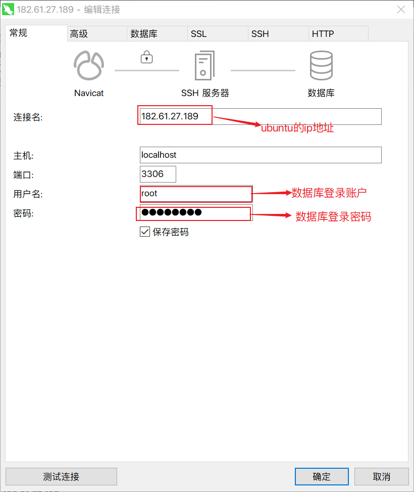

# 1.更新系统
如果不运行该命令，直接安装mysql,会出现"有几个软件包无法下载
```bash
sudo apt-get update
```

# 2.安装mysq
```bash
sudo apt-get install mysql-server mysql-client
```
安装时候需要输入密码，密码是root用户的密码

# 3.查看是否成功
安装成功后可以通过下面的命令测试是否安装成功：
```bash
sudo netstat -tap | grep mysql
```
出现如下信息证明安装成功：


# 4.登录mysql，进行授权
```bash
mysql -u root -p mysql密码
```
进入mysql服务，执行授权命令：
```bash
grant all on *.* to '账户名'@'%' identified by '你的密码' with grant option;
flush privileges;
```
# 5.设置数据库允许外网访问
```bash
sudo vim /etc/mysql/mysql.conf.d/mysqld.cnf
```
注释掉
```
bind-address = 127.0.0.1
```

保存退出，重启mysql，执行命令
```bash
sudo service mysql restart
```

# 6.在本地实用数据库连接工具进行连接测试





[在ubuntu服务器上安装mysql并配置外网访问](https://www.cnblogs.com/zou-zou/p/9661422.html)

[ubuntu服务器安装配置mysql](https://blog.csdn.net/qq_39817332/article/details/90696987)