<!-- TOC -->

- [课件](#课件)
- [SE02 软件过程](#se02-软件过程)
    - [软件过程模型](#软件过程模型)
        - [瀑布模型](#瀑布模型)
        - [演化过程模型](#演化过程模型)
            - [原型开发](#原型开发)
            - [螺旋模型](#螺旋模型)
        - [统一过程模型](#统一过程模型)
- [SE03 软件工程实践](#se03-软件工程实践)
    - [沟通实践](#沟通实践)
        - [沟通原则](#沟通原则)
        - [沟通活动通用任务集](#沟通活动通用任务集)
    - [策划实践](#策划实践)
        - [策划原则](#策划原则)
        - [策划活动通用任务集](#策划活动通用任务集)
    - [建模实践](#建模实践)
        - [分析建模实践](#分析建模实践)
            - [分析建模的原则](#分析建模的原则)
            - [通用分析建模任务集](#通用分析建模任务集)
        - [设计建模实践](#设计建模实践)
            - [设计建模原则](#设计建模原则)
            - [通用设计任务集](#通用设计任务集)
    - [构造实践](#构造实践)
        - [编码](#编码)
            - [编码原则](#编码原则)
            - [通用构造任务集](#通用构造任务集)
        - [测试](#测试)
            - [测试原则](#测试原则)
            - [通用测试任务集](#通用测试任务集)
    - [部署实践](#部署实践)
        - [部署原则](#部署原则)
        - [通用部署任务集](#通用部署任务集)
- [SE05 需求工程](#se05-需求工程)
    - [需求工程重要性](#需求工程重要性)
    - [需求工程任务](#需求工程任务)
    - [启动需求工程](#启动需求工程)
    - [导出需求](#导出需求)
    - [开发用例](#开发用例)
    - [构建分析模型](#构建分析模型)
    - [协商需求](#协商需求)
    - [确认需求](#确认需求)
- [SE06 构建分析模型](#se06-构建分析模型)
    - [需求分析](#需求分析)
    - [分析建模的方法](#分析建模的方法)
    - [基于场景建模](#基于场景建模)
    - [基于类建模](#基于类建模)
    - [生成行为模型](#生成行为模型)
    - [结构化分析](#结构化分析)
    - [数据建模概念](#数据建模概念)
    - [面向流的建模](#面向流的建模)
- [SE07 设计工程](#se07-设计工程)
    - [软件工程中的设计](#软件工程中的设计)
    - [设计过程和设计质量](#设计过程和设计质量)
    - [设计概念](#设计概念)
    - [设计模型](#设计模型)
- [SE08 进行体系结构设计](#se08-进行体系结构设计)
    - [体系结构建模](#体系结构建模)
    - [体系结构风格](#体系结构风格)
    - [特定领域体系结构](#特定领域体系结构)
    - [体系结构框架](#体系结构框架)
        - [MVC框架即模型—视图—控制器（model-view-controller）框架。](#mvc框架即模型视图控制器model-view-controller框架)
        - [PCMEF框架](#pcmef框架)
        - [J2EE框架](#j2ee框架)
    - [映射数据流到软件体系结构](#映射数据流到软件体系结构)
- [SE09 构件级设计建模](#se09-构件级设计建模)
    - [设计基于类的构件](#设计基于类的构件)
        - [面向对象软件工程方法中构件级设计主要关注](#面向对象软件工程方法中构件级设计主要关注)
        - [设计基于类的构件需要遵循一系列的](#设计基于类的构件需要遵循一系列的)
        - [设计基于类的构件需要关注](#设计基于类的构件需要关注)
        - [设计原则](#设计原则)
        - [内聚性](#内聚性)
        - [耦合性](#耦合性)
    - [构件级设计建模](#构件级设计建模)
        - [实施构件级设计](#实施构件级设计)
        - [设计传统构件](#设计传统构件)
- [SE10 软件测试策略](#se10-软件测试策略)
    - [传统软件的测试策略](#传统软件的测试策略)
        - [V模型：描述软件开发各阶段与测试策略之间的对应关系。](#v模型描述软件开发各阶段与测试策略之间的对应关系)
        - [传统软件的测试策略分为](#传统软件的测试策略分为)
        - [调试](#调试)
- [试卷上的知识点](#试卷上的知识点)

<!-- /TOC -->

# 课件

# SE02 软件过程

软件工程是

1. 把系统化的,规范化的,可度量的途径应用于软件开发,运行和维护的过程,也就是把工程化应用于软件中
2. 研究1中提到的途径

软件是一种层次化的技术

​		从上到下依次是

- 工具
- 方法
- 过程
- 质量关注点

典型的普适性活动

- 软件项目跟踪和控制
- 风险管理
- 软件质量保证
- 正式的技术复审
- 测量
- 软件配置管理
- 可复用管理
- 工作产品的准备和产生

## 软件过程模型

瀑布模型   演化模型	统一过程模型

### 瀑布模型

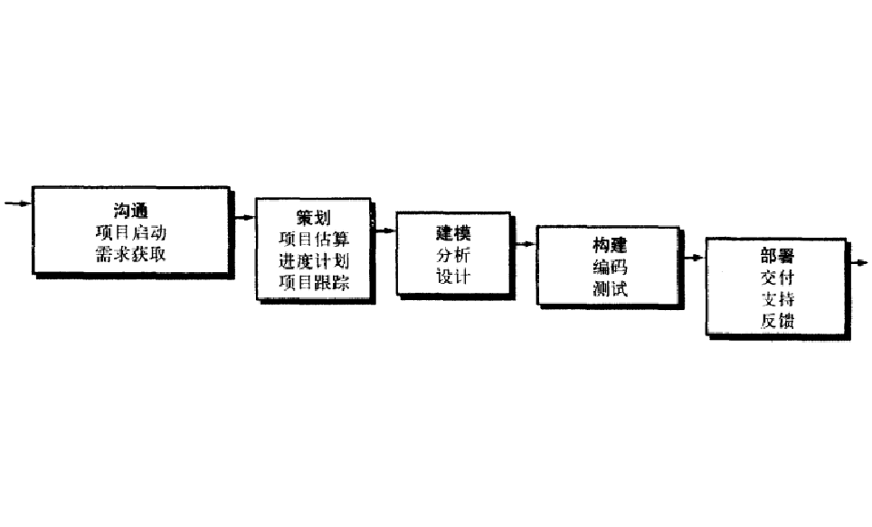

### 演化过程模型

​		原型开发	螺旋模型

#### 原型开发

原型的类型

- 探索型
- 实验型
- 演化型

原型的使用策略

- 废弃策略：主要用于探索型和实验型原型的开发。
- 追加策略：主要用于演化型原型的开发。

**原型可作为单独的过程模型使用，它也常被作为一种方法或实现技术应用于其它的过程模型中。**

#### 螺旋模型

螺旋模型是一种演进式软件过程模型。

- 结合了原型的迭代性质和瀑布模型的系统性和可控性特点。
- 具有快速开发越来越完善软件版本的潜力。

### 统一过程模型

- 用力驱动
- 以体系架构为核心
- 迭代并且递增

# SE03 软件工程实践

David Hooker提出7个关注软件工程整体实践的核心原则。

- 第1原则:存在价值
- 第2原则:保持简洁
- 第3原则:维护视图
- 第4原则:生产者要让消费者理解
- 第5原则:面向未来
- 第6原则:计划复用
- 第7原则:认真思考

## 沟通实践

### 沟通原则

- 原则#1：倾听
- 原则#2：有准备的沟通
- 原则#3：需要有人推动
- 原则#4：最好当面沟通
- 原则#5：记录所有决定
- 原则#6：保持通力协作
- 原则#7：聚焦并协调话题
- 原则#8：采用图形表示
- 原则#9：继续前进原则
- 原则#10：谈判双赢原则

### 沟通活动通用任务集

- 1.识别主要客户和其他共利益者
- 2.与主要客户会谈“环境无关的问题” ，确定：
  - 业务需要和商业价值
  - 最终用户的特性需要
  - 需要的用户可见输出
  - 业务约束
- 3.写一页项目范围（范围往往会修订）的说明
- 4.评审范围说明，并应客户要求做出相应修改
- 5.与客户/最终用户进行协作，确定以下内容：
  - 采用标准格式记录客户可见的使用场景
  - 输入和输出
  - 重要的软件特性、功能和行为
  - 客户定义的商业风险
- 6.简要书面描述(例如一些列表)场景、输出/输入、特性/功能以及风险。
- 7.与客户反复交换意见以细化场景、输出/输入、特性/功能以及风险
- 8.为每个用户场景、特性、功能和行为分配客户定义的优先级
- 9.回顾在与客户和其他共利益者交流时搜集的所有信息、并且按照要求修订
- 10.为计划活动做准备

## 策划实践

### 策划原则

- 原则#1：理解项目范围
- 原则#2：客户参与策划
- 原则#3：采用迭代计划
- 原则#4：基于已知估计
- 原则#5：计划考虑风险
- 原则#6：保持脚踏实地
- 原则#7：调整计划粒度
- 原则#8：制定计划确保质量
- 原则#9：描述如何适应变化
- 原则#10：经常跟踪、校正计划。

### 策划活动通用任务集

- 再评估项目范围
- 评估风险
- 确定和细化用户场景
- 从用户场景中抽象出功能与特征
- 确定实现软件基本要求的技术功能与特征
- 按照用户优先级对用户特有的功能与特征（场景）分组
- 制定一个粗粒度的项目计划
  - 确定预计的软件增量个数
  - 确定整个项目的进度
  - 为每一个增量确定预订的交付时间
- 为当前的迭代制定细粒度项目计划
    - 为每个功能特征制定工作任务
    - 对每个工作任务分派责任
    - 确定要开发的工作产品
    - 确定要使用的质量保证方法
    - 描述处理变更的方法
- 定期追踪进度
  - 注意可能出现的问题(例如，进度延误)
  - 按需调整进度

## 建模实践

### 分析建模实践

#### 分析建模的原则

- 原则#1：必须描述并理解问题的信息域
- 原则#2：必须确定软件所要实现的功能
- 原则#3：必须描述软件的行为（作为外部事件的结果）。
- 原则# 4：描述信息、功能和行为的模型必须以一种能揭示分层（或者分级）细节的方式分解开来。
- 原则# 5：分析任务应该从本质信息转向实现细节。

#### 通用分析建模任务集

- 评审业务需求、最终用户特征/要求、用户可见输出、业务约束以及其他一些在客户沟通和策划活动中需要确定的技术需求。

- 扩展和细化用户场景	
  - 定义所有的角色。

  - 表达角色如何与系统交互。

  - 从用户场景中抽象出功能和特征

  - 评审用户场景的完备性和准确性

- 信息域建模

  - 描述所有主要信息对象
  - 定义每个信息对象的属性
  - 表达信息对象之间的关系

- 功能域建模

    - 表达出功能如何修改数据对象
    - 细化功能以提供细节
    - 书写叙述性的过程来描述每个功能和子功能
    - 评审功能模型

- 行为域建模

     - 确定引起系统行为变化的外部事件
    - 确定表明每个外部可见行为模型的状态
    - 描述事件如何引起系统的状态转换
    - 评审行为模型

- 用户接口分析和建模

  - 实施任务分析。
  - 创建屏幕视图原型。

- 评审所有模型，考虑完备性、一致性

  

### 设计建模实践

#### 设计建模原则

- 原则#1：设计可追溯到分析模模型
- 原则#2：经常关注待建系统的架构
- 原则#3：数据设计与功能设计同等重要
- 原则#4：必须设计接口(包括内部接口和外部接口)
- 原则#5：用户界面设计必须符合最终用户要求
- 原则#6：功能独立的构件级设计
- 原则#7：构件之间以及构件与外部环境之间松散藕合。
- 原则#8 ：设计表述(模型)应该做到尽可能易于理解。
- 原则#9 ：设计应该迭代式进行。每次迭代，设计者都应该尽力简化。

#### 通用设计任务集

- 使用分析模型，选择适合软件的架构风格（模式）
- 把分析模型划分成若干设计子系统，并按照架构分配到各个子系统中
    - 确定每个子系统都是功能耦合的。
    - 设计子系统接口。
    - 把分析的类或功能分配到各个子系统中。
    - 使用信息域模型，设计合适的数据结构。
- 设计用户界面
    - 评审任务分析结果。
    - 确定基于用户场景的活动顺序。
    - 创建界面行为模型。
    - 定义界面对象和控制机制。
    - 评审界面设计并进行必要的修正。
- 进行构件级设计
    - 在较低层抽象级上确定所有的算法。
    - 精化每个构件的接口。
    - 定义构件级的数据结构。
    - 评审构件级设计。
- 开发部署模型

## 构造实践

### 编码

#### 编码原则

- 准备原则
- 编码原则
- 确认原则

#### 通用构造任务集

- 构建基本架构
    - 评审架构设计。
    - 编码并测试构件以实现基本架构。
    - 获得可复用的架构模式。
    - 测试基本构架以确保接口完整性。
- 构建软件构件
    - 评审构件级设计。
    - 对构件进行编码和单元测试。
    - 对构件数据结构和接口进行编码。
    - 对内部算法和相关处理功能进行编码。
    - 在编码完成时评审代码。
    - 检查正确性。
    - 确保遵循编码标准。
    - 确保编码有注释。
- 构件单元测试。
    - 进行所有的单元测试。
    - 纠正所发现的错误。
    - 重复单元测试。
- 将已经完成的构件集成到基本构架中

### 测试

#### 测试原则

- 所有的测试都应该可以迫溯到用户需求。
- 测试计划应该远在测试开始前就开始着手。
- 将pareto原则(2/8法则）应用于软件测试。
- 测试应从“微观”开始，逐步转向“宏观”。
- 穷举测试是不可能的。

#### 通用测试任务集

- 为每个软件构件模块设计单元测试
    - 查看每个单元测试以确保完全覆盖。
    - 执行单元测试。
    - 改正发现的错误。
    - 再次执行单元测试。
- 制定一个集成策略
    - 确定执行集成策略的顺序。
   -  定义“构建”以及检验这些构件所需要的测试。
    - 每天进行“冒烟”测试。
    - 必要时进行回归测试。
- 制定确认策略
    - 确定确认准则。
    - 定义确认软件的测试。
- 执行集成测试和确认测试
    - 改正发现的错误。
    - 必要时重复进行测试。
- 执行高层次测试
    - 进行恢复性测试
    - 进行安全测试
    - 进行压力测试
    - 进行性能测试
- 与客户进行验收测试

## 部署实践

### 部署原则

- 客户对于软件的期望必须得到管理。
- 完整的交付包应该经过安装和测试。
- 技术支持必须在软件交付之前就确定下来。
- 必须为最终用户提供适当的说明材料。
- 有缺陷的软件应该先改正再交付。

### 通用部署任务集

- 创建交付介质
- 确定支持人员或团队
- 确立用户反馈机制
- 向用户公布要交付的介质
- 建立不断发展的支持功能。
- 收集用户反馈。

# SE05 需求工程
## 需求工程重要性
## 需求工程任务
 - 起始
 - 导出
 - 精化
 - 协商
 - 规格说明
 - 确认
 - 管理
## 启动需求工程
步骤:
 - 确定共利益者
 - 识别多种观点
 - 协同合作
 - 首次提问
## 导出需求
方法:
 - 协同需求收集
 - 质量功能部署
    三类需求:
    - 正常需求
    - 期望需求
    - 令人兴奋的需求
 - 用户场景
## 开发用例
## 构建分析模型
- 分析模型应为基于计算机的系统提供必要的信息域、功能域和行为域的说明。
- 分析模型是任意给定时刻的需求的快照，它可以变化。
- UML描述的分析模型
    - 基于场景的元素
    - 基于类的元素
    - 行为元素
## 协商需求
 - 客户和开发人员协商需求
 - 最好的协商是争取“双赢”（Win-Win）的结果
## 确认需求
- 需要检查分析模型的 一致性、是否有遗漏以及歧义性。
- 模型所表示的需求由客户划分优先级并组合成一个整体，该需求整体将实现为一系列软件增量并交付给客户。
# SE06 构建分析模型
## 需求分析
- 需求分析
  - 产生软件操作特征的规格说明
  - 指明软件和其他系统元素的接口
  - 建立软件必须满足的约束
- 分析模型
  - 描述用户场景
  - 描述功能活动
  - 描述问题类和类之间的关系
  - 描述系统和类行为
  - 描述数据流
- 需求分析向设计者提供信息、功能和行为的表示
-  在整个分析建模过程中，软件工程师的主要关注点集中在“做什么”而不是“怎么做”
- 整体目标和原理
    - 描述客户需要什么
    - 为软件设计奠定基础
    - 定义在软件完成后可 以被确认的一组需求 
    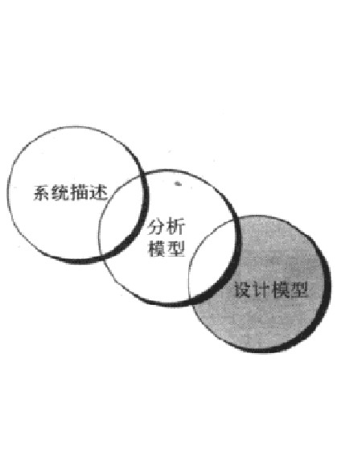
- 分析的经验原则
  - “不要陷入细节” ，即不要试图解释系统将如何工作。
  - ***分析模型的每个元素都应能增加对软件需求的整体理解，提供对信息域、功能和系统行为的深入理解。***
  - ***关于基础结构和其他非功能的模型应推延到设计阶段再考虑。***
  - 最小化整个系统内的关联。
  - 确认分析模型为所有共利益者都带来价值。
  - 尽可能保持模型简洁。
## 分析建模的方法
- 分析建模的方法主要有面向对象分析和结构化分析两种
  - **面向对象分析**：关注于定义类和影响客户需求的类之间的协作方式。
  - **结构化分析**：考虑数据和数据处理的分析建模方法。
- 分析模型应组合两种方法的表示手段为共利益者提供最好的软件需求模型和过渡到软件设计的最有效方法。
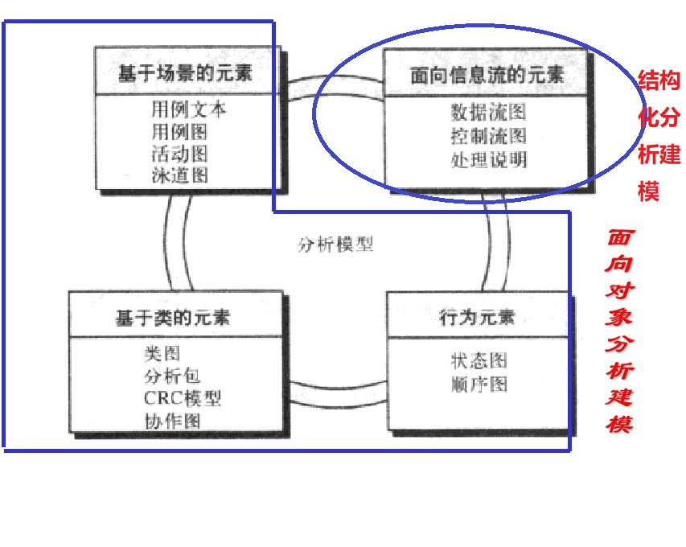
- 面向对象分析
  1. 在客户端可开发者必须对基本需求进行交流
  2. 确定类
  3. 定义类的层次结构
  4. 表现对象与对象的关系
  5. 为对象行为建模
  6. 上述1~5的工作步骤重复迭代直至模型完成
## 基于场景建模
- 基于场景建模可以刻画最终用户(和其他参与者)希望如何与系统交互。
- 基于场景的UML分析建模
    - 开发用例
        - 编写用例包括绘制用例图、详细描述用例。
        - 用例描述的三种主要形式
            - 文本描述
            - 活动图
            - 界面原型
    - 活动图
    - 泳道图
## 基于类建模
- 类图
  - 识别分析类
  - 描述属性：给分析类开发一个有意义的属性集合
  - 定义操作：描述对象行为
- 类的职责分类
  - 实体类:也被称作模型或业务类。
  - 边界类:创建用户可见的和交互的接口。
  - 控制类:管理自始至终的“工作单元”，到设计阶段才开始考虑控制类。
## 生成行为模型
* 行为模型显示软件如何对外部事件或激励作出响应。要生成行为模型的主要步骤:
    * **评估所有的用例**，以保证完全理解系统内的交互序列。
    * **识别驱动交互序列的事件**，并理解这些事件如何和具体的类相互关联。
    * **为每个用例生成序列。**
    * **创建系统状态图**
    * **评估行为模型以验证准确性和一致性**

## 结构化分析
- 结构化分析是一种面向功能的、自顶向下的软件建模方法，它将软件按功能分解为许多相互作用的功能模块，这就是著名的**功能分解**。
- 结构化分析需要在多个抽象层次上，因而功能分解往往采取**逐步细化**的方法进行。
    - 开始是站在高处统观全局，
    - 最后对各主要功能模块详细描述，直到可实现的程度。
- 结构化分析建模中提供了大量的可视化技术，主要有：

    - 数据流图（DFD)(用来表示一个系统或软件在任何层次上的抽象)
        - 采用自顶向下的方法，DFD开始于环境图，结束于模块规格说明。
        - 较大型软件系统的DFD分成多层，可以表示数据流和功能的进一步的细节。
    - 实体关系图（ERD）(简称ER图，它用来描述现实世界的概念模型。它也能在较高的抽象层次（概念层）对数据库结构进行建模的一种有效方法。)
        基本成分
        - 实体型
        - 属性
        - 关系
    - 状态转换图（STD）(通过描绘系统的状态以及引起系统状态转换的事件，来表示系统的行为。)
    三要素
        - 事件
        - 状态
        - 行为
  
## 数据建模概念
## 面向流的建模
# SE07 设计工程
## 软件工程中的设计
- 软件设计是软件工程过程的技术核心，**它开始于需求分析和需求建模完成之后。**
- 设计规约通常包括的四种设计模型
    - 数据/类设计:将分析类模型转化为设计类的实现以及软件实现所要求的数据结构。
    - 体系结构设计:定义软件的主要结构元素之间的联系、可用于达到系统所定义需求的体系结构风格和设计模式以及影响体系结构实现方式的约束。
    - 接口设计:描述软件和协作系统之间、软件和使用人员之间是如何通信的。
    - 构件设计:将软件体系结构的结构元素变换为对软件构件的过程性描述。
  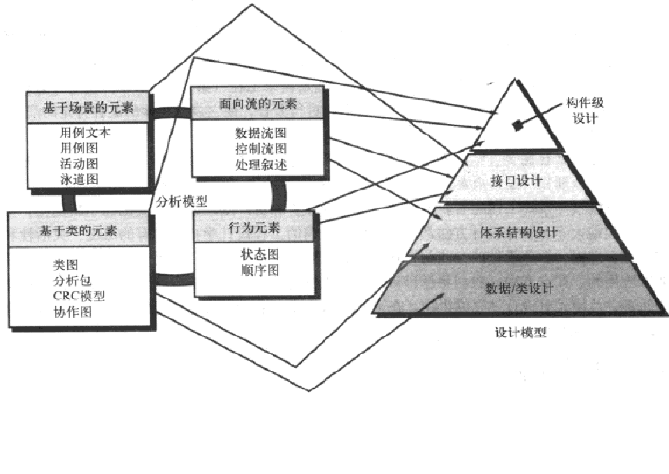
## 设计过程和设计质量
- 指导评价良好设计演化的三个特征:
    - 设计必须实现所有包含在分析模型中的明确需求，而且必须满足客户期望的所有隐含需求。
    - 对于那些生成代码的人和那些进行测试以及维护软件的人而言，设计必须是可读的、可理解的指南。
    - 设计必须提供软件的全貌，从实现的角度说明数据域、功能域和行为域。
- 质量指导原则
    - 设计应导出显示独立功能特征的构件。
    - 设计应导出接口，这些接口降低构件之间以及与外部环境连接的复杂性。
    - 设计的导出应根据软件需求分析过程中获取的信息,采用可重复使用的方法进行。
    - 应使用能够有效传达其意义的表示法来表达设计。
- 通常设计任务集
    1. 检查信息域模型，并为数据对象及其属性设计恰当的数据结构。
    2. 使用分析模型，选择一个合适的软件体系结构类型(模式)。
    3. 将分析模型分割为若干个设计子系统，并在体系结构内分配这些子系统。
    4. 创建一系列的设计类或构件，将每个分析类说明转化为设计类
    5. 设计外部系统或设备所需要的所有接口。
    6. 设计用户接口
    7. 进行构件级设计
    8. 开发部署模型
## 设计概念
- 体系结构
  - IEEE的定义: 
    - 体系结构={构件，连接件，环境，原理}
    - 体系结构是以构件、构件之间的关系、构件与环境之间的关系为内容的某一系统的基本组织结构以及指导上述内容设计与演化的原理。
  - 体系结构设计可以使用多种模型来表达
    - 结构模型
    - 功能模型
    - 动态模型
    - 过程模型
    - 框架模型
- 设计类
  - 五中不同的设计类
    - **用户接口类**：定义人机交互。
    - **业务域类**：对早期定义的分析类进行精化，这些类识别实现某些业务域元素所必需的属性和服务(方法)。
    - **过程类**：实现完整管理业务域类所必需的低层业务抽象。
    - **持久类**：代表将在软件执行之外持续存在的数据存储(例如，数据库)。
    - **系统类**：实现软件管理和控制功能，使得系统能够运行并在其计算环境内与外界通信。
  - 良好定义设计类的四个特征
    - 完整性与充分性
    - 原始性：和某个设计类相关
    - 方法应该关注于实现类的某个服务。
    - 高内聚
    - 低耦合
## 设计模型
- 设计模型可以从两个不同的维度观察
    - 过程维度:表示设计模型的演化
    - 抽象维度:表示过程的详细级别
- 设计模型中通常包含的元素
    - 数据设计元素
    - 体系结构设计元素
    - 接口设计元索
    - 构件级设计元素
    - 部署级设计元素
# SE08 进行体系结构设计
## 体系结构建模
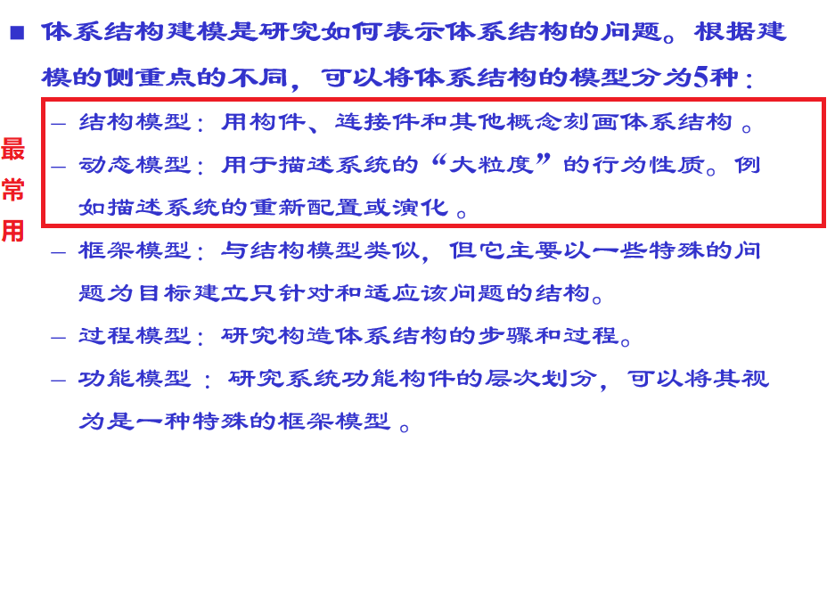
## 体系结构风格
- 数据流风格
  数据流风格的特点
   - 当输入数据经过一系列的计算和操作构件的变换形成输出数据时，可以应用这种体系结构。
   - 管道/过滤器、批处理序列属于数据流风格。
- 管道/过滤器风格
   - 拥有一组过滤器构件，这些构件通过管道连接管道将数据从一个构件传送到下一个构件。
   - 每个过滤器独立于其上游和下游的构件而工作，过滤器的设计要针对某种形式的数据输入，并且产生某种特定形式的数据输出。
   - 如果数据流退化成为单线的变换，则称为批处理序列。这种结构接收一批数据，然后应用一系列连续的构件（过滤器）变换它。
- 调用—返回风格
  在此类体系结构中，存在以下3种子风格。
    - 主程序/子程序风格
        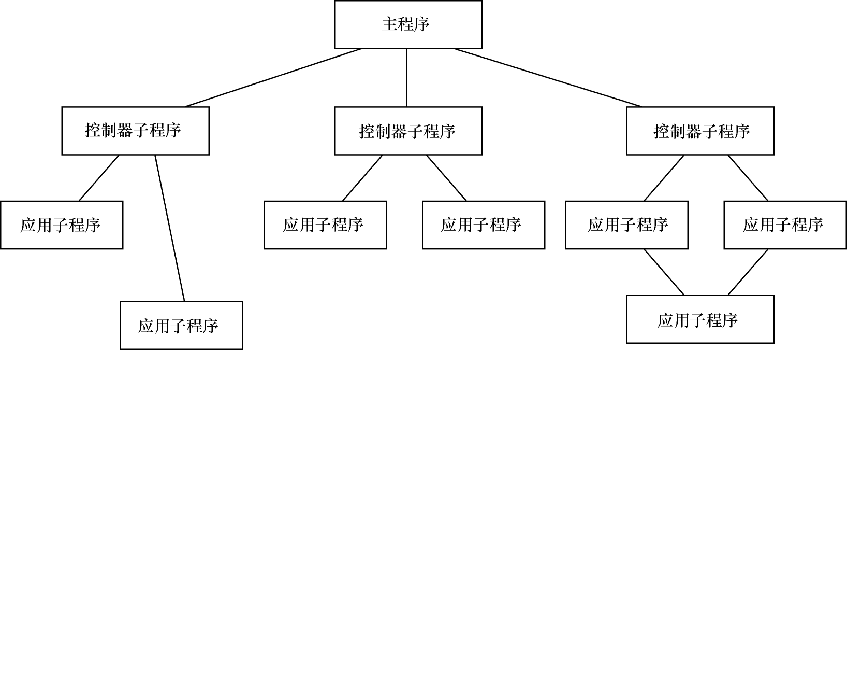
    - 面向对象风格
    - 分层风格
        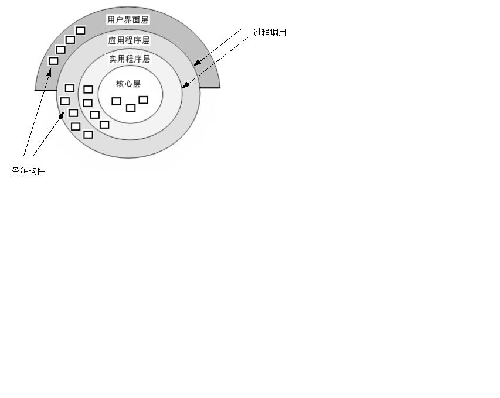
- 仓库风格
## 特定领域体系结构
- 分布式系统结构
    - 传统的C/S体系结构
      - 客户/服务器体系结构的两种形态
         - 胖客户机模型：服务器只负责对数据的管理。客户机上的软件实现应用逻辑和与系统用户的交互。主要缺点：
             - 开发成本较高。
             - 用户界面风格不统一，使用繁杂，不利于推广使用。
             - 软件移植困难。
             - 软件维护和升级困难
    - 三层C/S体系结构
        三层C/S体系结构将整个系统分成表示层、应用逻辑层和数据层三个部分
        - B/S体系结构
            - **表示层**：应用系统的用户界面部分，担负着用户与应用程序之间的对话功能。它用于检查用户输入的数据，显示应用程序输出的数据，一般采用图形用户界面。
            - **应用逻辑层**：应用系统的主体部分，包含具体的业务处理逻辑。通常在功能层中包含有确认用户对应用和数据库存取权限的功能以及记录系统处理日志的功能。
            - **数据层**：数据层主要包括数据的存储及对数据的存取操作，一般选择关系型数据库管理系统（RDBMS）。
    - 分布式对象体系结构 
    - 面向服务的体系结构

## 体系结构框架
### MVC框架即模型—视图—控制器（model-view-controller）框架。
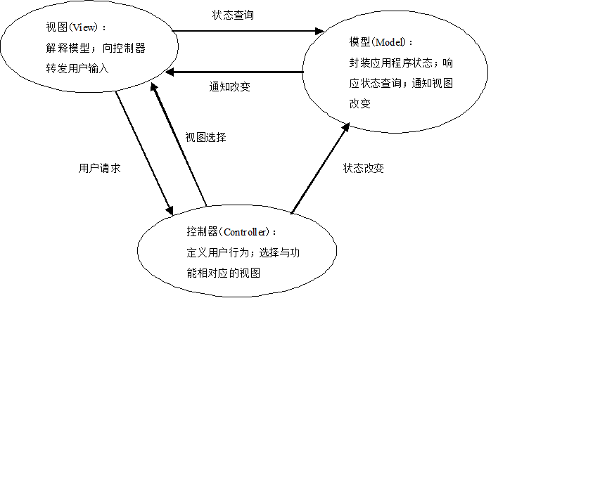
  - Asp.net MVC2框架
    - 优点
        - MVC各负其责，代码耦合性更低
        - URL可控
        - 易于对界面逻辑进行单元测试
        - 易于客户端脚本编程
        - 易于前后台编码人员配合
        - ViewEngine、Action Filter等部件均可替换或定置
        - 公开源代码
    - 缺点
        - 使得大量现有控件难以直接使用
        - 存在许多约定，不易于初学者理解
        - 没有webForm易于使用

### PCMEF框架
    - PCMEF是表示、控制、中介者、实体和基础的首字母缩写（presentation-control-mediator-entity-foundation，PCMEF）
    - PCMEF是一个垂直层次的分层体系结构框架。每一层是可以包含其他包的包。
- PCMEF框架包含4层
    - 表示层
    - 控制层
    - 领域层：包含实体包和中介者两个预定义包。 
    - 基础层
- 七大原则
    - 向下依赖性原则
    - 向上通知原则
    - 相邻通信原则
    - 显式关联原则
    - 循环消除原则
    - 类命名原则
    - 相识包原则
### J2EE框架
 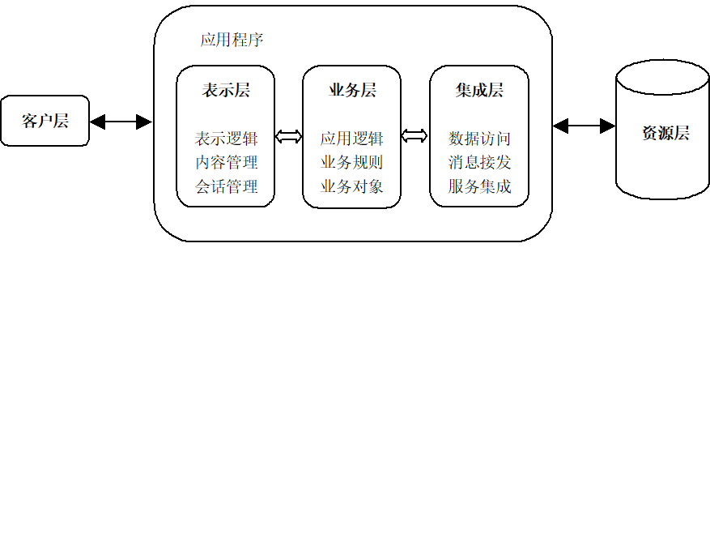

## 映射数据流到软件体系结构

# SE09 构件级设计建模
## 设计基于类的构件
### 面向对象软件工程方法中构件级设计主要关注
- 分析类的细化(特定的问题域类)和基础类的定义和精化。
- 这些类的属性、操作和接口的详细描述是开始构建活动之前所需的设计细节。
### 设计基于类的构件需要遵循一系列的
-  基本设计原则
-  指导方针
### 设计基于类的构件需要关注
- 内聚性
- 耦合性
### 设计原则
- 开关原则(OCP):模块应该对外延具有开放性，对修改具有封闭性。
- Liskov替换原则(LSP):子类可以替换它们的基类。
    - 基类与使用该基类的构件之间的隐含约定。
      - 前置条件：构件使用基类前必须为真
      - 后置条件：构件使用基类后必须为真。
- 依赖倒置原则(DIP):依赖于抽象，而非具体实现
- 接口分离原则(ISP):多个用户专用接口比一个通用接口要好
### 内聚性
- **功能内聚**：指模块内所有元素共同完成一个功能,缺一不可，因此模块不能再分割. 
- **分层内聚**：由包、构件和类来表现。高层能够访问低层的服务，但低层不能访问高层。
- **通信内聚**：访问相同数据的所有操作被定义在一个类中。这些类只着眼于数据的查询、访问和存储。
- **顺序内聚**：将构件或者操作按照前者为后者提供输入的方式组合，目的在于实现一个操作的序列。
- **过程内聚**：构件或者操作的组合方式是，允许在调用前面的构件或操作之后，马上调用后面的构件或操作，即使两者之间没有数据进行传递。
- **暂时内聚**：操作的执行是为了反映某一指定的行为或状态，例如在启动时要执行的某一操作或者在错误检测时所要执行的全部操作。
- **实用内聚**：在一类里，但是在其他方面不相关的构件、类或操作被分成一组。
### 耦合性
藕合是类之间彼此联系程度的一种定性度量。若类(构件)相互依赖越来越多，类之间的耦合程度亦会增加。在构件级设计中，**一个重要的目标就是尽可能保持低耦合**。
- **内容耦合**：当一个构件“暗中修改其他构件的内部数据时，就会发生此种类型的耦合。” 这违反了基本设计概念当中的信息隐蔽原则。
- **共用藕合**：当大量的构件都要使用同一个全局变量时发生此种耦合。
- **控制耦合**：当操作A调用操作B，并且向B传递了一个控制标记时，就会发生此种耦合。
- **印记耦合**：当类B被声明为类A某一操作中的一个参数类型时会发生此种耦合。由于类B现在作为类A定义的一部分，所以修改系统就会变得更为复杂。
- **数据耦合**：当操作需要传递较长的数据参数时就会发生此种耦合。随着类和构件之间通信“带宽’的增长以及接口复杂性的增加，测试和维护就会越来越困难。
- **例程调用耦合**：当一个操作调用另外一个操作时就会发生此种耦合。这种级别的耦合很常见，并且常常是必要的。然而，它也确实增加了系统的连通性。
- **类型使用耦合**：当构件A使用了在构件B中定义的一个数据类型时会发生此种耦合。如果类型定义发生了改变，每个使用该定义的构件一也必须随之改变。
- **包含或者导入耦合**：当构件A引入或者包含一个构件B的包或者内容时，就会发生此种耦合。
- **外部耦合**：当一个构件和基础设施构件进行通信和协作时会发生此种耦合。尽管这种类型的耦合是必要的。但是在一个系统中应该尽量将此种耦合限制在少量的构件或者类范围中。

## 构件级设计建模
### 实施构件级设计
**步骤**
- Step1. 标识出所有与问题域相对应的设计类。
- Step2. 确定所有与基础设施域相对应的设计类。
- Step3.细化所有不能作为复用构件的设计类。
    - 详细描述实现类需要的所有接口、属性和操作。考虑设计模式以降低藕合性，提高内聚性。
- Step3a.在类或构件的协作时说明消息的细节。
- Step3b.为每一个构件确定适当的接口。
- Step3c.细化属性并定义相应的数据类型和数据结构。
- Step3d.详细描述每个操作中的处理流。
- Step4.说明持久数据源(数据库和文件)并确定管理数据源所需要的
- Step5.开发并且细化类或构件的行为表示。
- Step6 细化部署图以提供额外的实现细节。
- Step7 考虑每一个构件级设计表示，并且时刻考虑其他选择。
### 设计传统构件
**传统构件的设计常用表示方法**
- 图形化设计表示
- 表格式设计表示
- 程序设计语言
# SE10 软件测试策略
## 传统软件的测试策略

### V模型：描述软件开发各阶段与测试策略之间的对应关系。
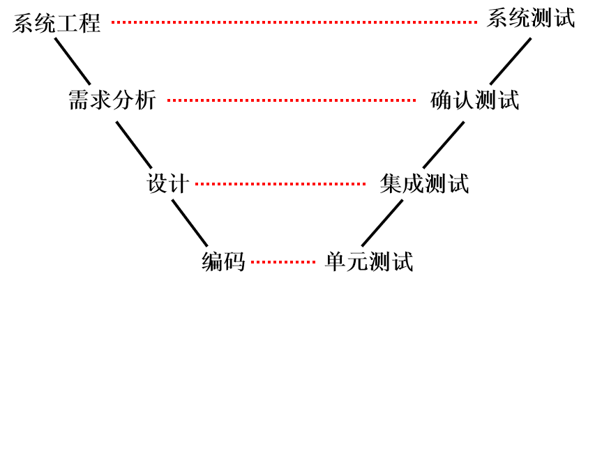

### 传统软件的测试策略分为
- **单元测试**:是针对程序中的模块或构件，主要揭露编码阶段产生的错误。
          - 单元测试根据设计描述，对重要的控制路径进行测试，以发现构件或模块内部的错误
          - **单元测试通常采用白盒测试**，并且多个构件或模块可以并行进行测试
    - 测试内容
        - 模块接口
        - 局部数据结构
        - 边界条件
        - 所有独立路径
        - 所有错误处理路径
- **集成测试**:针对集成的软件系统，主要揭露设计阶段产生的错误。
    - 原因
        - 数据可能在通过接口时丢失；
        - 一个模块可能对另一个模块产生非故意的、有害的影响（即副作用）；
        - 当子功能被组合起来时，可能不能达到期望的主功能；
        - 单个模块可以接受的不精确性（如误差），连接起来后可能会扩大到无法接受的程度；
        - 全局数据结构可能会存在问题。
    - 方式
        - 非增量式集成
        - 增量式集成
            - 自顶向下集成
                从主控模块（主程序）开始，然后按照程序结构图的控制层次，将直接或间接从属于主控模块的模块按**深度优先**或**广度优先**的方式逐个集成到整个结构中，并对其进行测试。
                1. 主控模块（主程序）被直接用作驱动程序，所有直接从属于主控模块的模块用桩模块替换，然后对主控模块进行测试；
                2. 根据集成的实现方式（深度优先或广度优先），下层的桩模块一次一个地替换成真正的模块，从属于该模块的模块用桩模块替换，然后对其进行测试；
                3. 用回归测试来保证没有引入新的错误；
                4. 重复第2和第3步，直至所有模块都被集成。
            - 自底向上集成
                1. 将低层模块组合成能实现软件特定功能的簇；
                2. 为每个簇编写驱动程序，并对簇进行测试；
                3. 移走驱动程序，用簇的直接上层模块替换驱动程序，然后沿着程序结构的层次向上组合新的簇；
                4. 凡对新的簇测试后，都要进行回归测试，以保证没有引入新的错误；
                5. 重复第2步至第4步，直至所有的模块都被集成。
    - 回归测试：对已进行过的测试的子集重新执行，以确保对程序的改变和修改，没有传播非故意的副作用。
    - 冒烟测试是一种常用的集成测试方法，它让软件团队频繁地对项目进行评估。
  - 面向对象环境中的单元测试
      - 封装的类常是单元测试的重点，类中包含的操作是最小的可测试单元。
      - 传统的单元测试等价于面向对象中的类测试，也称类内测试。它包括类内的方法测试和类的行为测试。
  - 面向对象环境中的集成测试
        - **两种不同的策略**
              - 基于线程的测试
              - 基于使用的测试
- **确认测试**:是根据软件需求规约对集成的软件进行确认，主要揭露不符合需求规约的错误。
  - 确认测试标准
    - 是否实现了规约规定的全部功能要求
    - 文档资料是否完整、正确、合理
    - 其他的需求，如可移植性、可维护性、兼容性、错误恢复能力等是否满足。
  - α测试和β测试
    - **α测试**是由用户在开发者的场所进行的，软件在开发者对用户的“指导下”进行测试。经α测试后的软件称为β版软件。
    - **β测试**是由软件的最终用户在一个或多个用户场所进行的，与α测试不同，开发者通常不在测试现场。
- **系统测试**:是针对基于计算机系统中的软件，以揭露不符合系统工程中对软件要求的错误。
  - 常用的系统测试包括：
    - 恢复测试（recovery testing）
    - 安全测试（security testing）
    - 压力测试（stress testing）
    - 性能测试（performance testing）

### 调试
- 调试过程
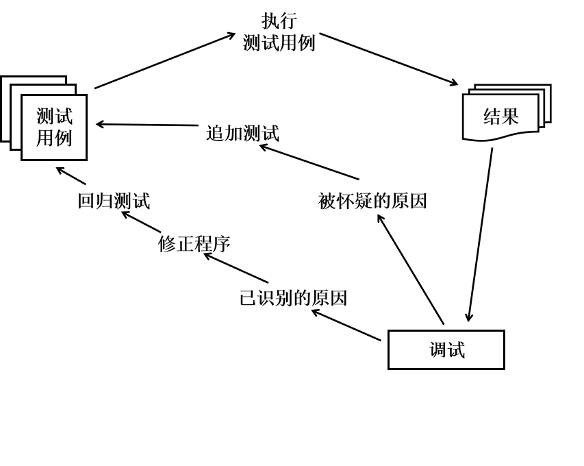
- 调试的方法
    - 蛮力法
    - 回溯法
    - 原因排除法
        - 归纳法:是一种从特殊推断一般的系统化思考方法
        - 演绎法:从一般原理或前提出发，假设所有可能出错的原因，排除不可能正确的假设，最后推导出结论

# 试卷上的知识点

适合于面向对象方法学的软件生存周期模型是 **喷泉模型**

从结构化的瀑布模型看，在它的生命周期中的八个阶段中，下面的几个选项中哪个环节出错，对软件的影响最大的是 **需求分析阶段**

**原型化方法** 对软件设计和开发人员的开发要求最高

结构化分析方法是一个预先严格定义需求的方法，它在实施时强调的是分
析对象的 **数据流**

软件开发的结构化生命周期方法将软件生命周期划分成 

- **计划阶段**
- **开发阶段**
- **运行阶段**

从实用角度看，数据规范化在大多数场合选用 **第3范式**。

模块的内聚性最高的是 **功能内聚**

**软件危机**:开发软件所需高成本和产品的低质量之间有着尖锐的矛盾

需求分析阶段的任务是确定 **软件系统的功能**

完整的软件结构通常用 **HIPO图** 来表示

再白盒测试中 **语句** 是最弱的覆盖标准

单元测试一般以**白盒测试为主,以黑盒测试为辅**

软件开发中长采用的结构化生命周期方法 ,由于其特征一般被称为 **瀑布模型**

**3大类软件概要设计方法**

- 以数据流图为基础构造模块结构的 ***结构化设计方法***
- 以数据结构为基础构造模块的 ***Jackson方法***
- 以对象 类 继承和通信为基础的 ***面向对象的设计方法***

***数据流图*** 和 ***数据字典*** 共同构成系统的逻辑模型

模块内的高内聚往往意味着模块间的松耦合

判定覆盖不一定包含条件覆盖,条件覆盖也不一定包含判定覆盖

在程序调试时,找出错误的位置和性质比改正错误更难

快速原型模型可以有效地适应用户需求的动态变化

模块化,信息隐藏,抽象和逐步求精的软件设计原则有助于得到高内聚,低耦合度的软件产品